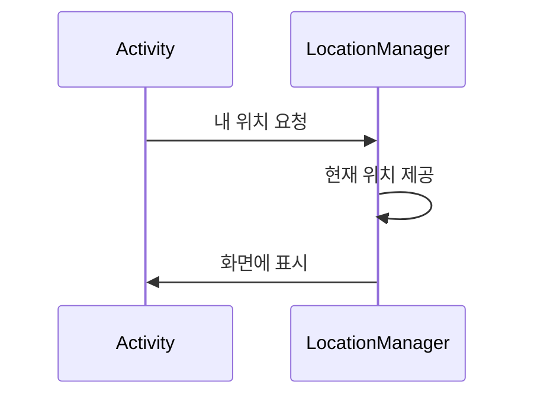

## Description

안드로이드는 `LocationManager`라는 시스템 서비스가 위치를 관리한다. `android.location` 패키지엔 위치 정보를 확인하거나 위치 정보를 사용할 때 필요한 클래스들이 정의되어 있다.

1. 메니페스트에 권한 추가
    * GPS를 사용할 수 있도록 `AndroidManifest.xml`에서 `ACCESS_FINE_LOCATION` 권한 추가
1. 위치 관리자 객체 참조
    * `getSystemService()` 메서드를 이용해 위치 관리자 객체 참조
1. 위치 리스너 구현
    * 새로운 리스너 구현하여 전달 받은 위치 처리
1. 위치 정보 업데이트 요청
    * 위치 정보가 변경될 때마다 요청하기 위해 `requestLocationUpdates()` 메서드를 호출


다음은 위치 정보를 요청하는 흐름을 그림으로 표현한 것이다.



## Implementation

우선 위치 정보를 사용하기 위해 `AndroidManifest.xml`에 다음 권한을 추가한다.

```xml
<uses-permission android:name="android.permission.ACCESS_FINE_LOCATION"/>
```

`activity_main.xml`에 하나의 버튼과 하나의 텍스트뷰를 추가한다.

```xml
<?xml version="1.0" encoding="utf-8"?>
<LinearLayout xmlns:android="http://schemas.android.com/apk/res/android"
    xmlns:app="http://schemas.android.com/apk/res-auto"
    xmlns:tools="http://schemas.android.com/tools"
    android:layout_width="match_parent"
    android:layout_height="match_parent"
    android:orientation="vertical"
    tools:context=".MainActivity">


    <Button
        android:id="@+id/button"
        android:layout_gravity="center"
        android:layout_width="wrap_content"
        android:layout_height="wrap_content"
        android:text="Button" />

    <TextView
        android:id="@+id/textView"
        android:layout_gravity="center"
        android:textSize="20sp"
        android:layout_width="wrap_content"
        android:layout_height="wrap_content"
        android:text="TextView" />
</LinearLayout>
```

`MainActivity`에 버튼을 누르면 나의 GPS 위치를 알려주는 코드를 작성한다.

```java
public class MainActivity extends AppCompatActivity {
    TextView textView;

    @Override
    protected void onCreate(Bundle savedInstanceState) {
        super.onCreate(savedInstanceState);
        setContentView(R.layout.activity_main);

        textView = findViewById(R.id.textView);

        Button button = findViewById(R.id.button);
        button.setOnClickListener(new View.OnClickListener() {
            @Override
            public void onClick(View v) {
                startLocationService();
            }
        });

        ActivityCompat.requestPermissions(this,new String[]{Manifest.permission.ACCESS_FINE_LOCATION},101);
    }

    public void startLocationService(){
        // LocationManager 객체 참조
        LocationManager manager = (LocationManager)getSystemService(Context.LOCATION_SERVICE);

        try{
            // 마지막 위치 정보 받아온다.
            Location location = manager.getLastKnownLocation(LocationManager.GPS_PROVIDER);
            if(location != null){
                // 위도와 경도 가져온다.
                Double latitude = location.getLatitude();
                Double longitude = location.getLongitude();
                String message = "Recent Location : Latitude("+latitude+"), longitude("+longitude+")";

                textView.setText(message);
            }

            // 리스너 객체 생성
            GPSListener gpsListener = new GPSListener();
            // 10초
            long minTime = 10000;
            // 최소 거리
            float minDistance = 0;

            // 위치 관리자는 일정한 시간 간격으로 위치 정보를 확인하거나 일정 거리 이상을 이동했을 때 위치 정보를 전달하는 기능 제공한다. 다음 메서드를 통해 구현 가능하다.
            manager.requestLocationUpdates(LocationManager.GPS_PROVIDER,minTime,minDistance,gpsListener);
            Toast.makeText(this, "Location Check", Toast.LENGTH_SHORT).show();

        }catch (SecurityException e){
            e.printStackTrace();
        }
    }
    // 위치 리스너 구현
    class GPSListener implements LocationListener {
        // 위치가 변경되었을 때의 위치 정보를 받아온다.
        @Override
        public void onLocationChanged(@NonNull Location location) {
            Double latitude = location.getLatitude();
            Double longitude = location.getLongitude();
            String message = "My Location : Latitude("+latitude+"), longitude("+longitude+")";
            textView.setText(message);

        }

        @Override
        public void onStatusChanged(String provider, int status, Bundle extras) {

        }

        @Override
        public void onProviderEnabled(@NonNull String provider) {

        }

        @Override
        public void onProviderDisabled(@NonNull String provider) {

        }
    }
}
```

## Conclusion

버튼을 누르면 현재 위치 정보가 출력되고 위치를 변경하면 10초마다 위치를 확인하여 업데이트 해주는 것을 확인할 수 있다.

### References
- [Do It! Android Programming](https://github.com/mike-jung/DoItAndroid)
