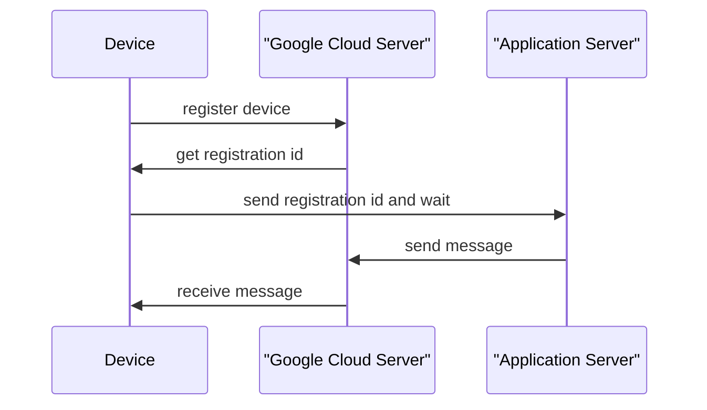

## Description

푸시 서비스란 업데이트 메시지와 같은 메시지를 구글 클라우드 서버에서 앱이 설치된 단말기로 보내주는 방식이다. 이러한 푸시 서비스를 사용하는 각각의 앱은 구글 클라우드 서버에 직접 연결하지 않고 단말에서 연결을 유지하고 있다. 

만약 구글 서비스를 사용하지 않고 직접 구현하려면 단말에서 서버로 연결을 유지하면서 동시에 연결을 지속적으로 유지해야한다. 따라서 연결이 끊겼는지 검사하는 Polling 메커니즘을 구현해야 하며 이는 복잡할 뿐만 아니라 단말의 하드웨어 리소스를 많이 소모하는 문제가 발생하게 된다. 결국 구글에서 제공하는 FCM이 가장 효과적으로 푸시 메시지를 보낼 수 있는 방법이다. 

다음은 안드로이드에서 제공하는 FCM 푸시 메시지 처리 과정이다.



## Implementation

앱을 2개 만들어 1개의 앱에선 푸시 메시지 수신, 나머지 1개의 앱에선 메시지를 전송하는 기능을 구현할 것이다.

### Firebase Setting

우선 파이어베이스 로그인 후 다음 순서로 설정한다.

1. 프로젝트 생성
1. 앱을 추가하여 시작하기
1. google-services.json 파일 다운로드 후 app 폴더에 저장

`build.gradle(Project)` 파일을 열고 dependencies 항목에 `com.google.gms:google-services:4.3.8` 추가한다.

```groovy
buildscript {
    dependencies {
        ...
        classpath 'com.google.gms:google-services:4.3.8'
    }
}
```

다음은 `build.gradle(Module)` 파일을 열고 다음과 같이 추가한다. 

```groovy
apply plugin: 'com.android.application'
apply plugin: 'com.google.gms.google-services'

dependencies {
    ...
    implementation platform('com.google.firebase:firebase-bom:28.1.0')
    implementation 'com.google.firebase:firebase-analytics'
    implementation 'com.google.firebase:firebase-messaging:20.0.0'
}
```

FCM을 사용할 수 있도록 서비스를 생성한다.

```java
// FirebaseMessagingService 클래스도 서비스 클래스이며 푸시 메시지 전달 받는 역할
public class MyFirebaseMessagingService extends FirebaseMessagingService {
    private static final String TAG = "FMS";

    public MyFirebaseMessagingService(){

    }
    // Firebase 서버에 등록되었을 때 호출된다. 파라미터로 전달받는 토큰 정보는 이 앱의 등록 id를 의미한다.
    @Override
    public void onNewToken(String token){
        super.onNewToken(token);
        Log.e(TAG, "onNewToken called : "+token);
    }

    // 메시지가 도착하면 해당 메서드 수행
    @Override
    public void onMessageReceived(@NonNull @NotNull RemoteMessage remoteMessage) {
        Log.d(TAG, "onMessageReceived called");

        String from = remoteMessage.getFrom();
        Map<String,String> data = remoteMessage.getData();
        String contents = data.get("contents");

        Log.d(TAG, "onMessageReceived: from : "+from+", contents : "+contents);
        sendToActivity(getApplicationContext(),from,contents);
    }

    // 푸시 메시지로 전달받은 데이터를 MainActvity로 전달
    private void sendToActivity(Context context, String from, String contents){
        Intent intent = new Intent(context,MainActivity.class);
        intent.putExtra("from",from);
        intent.putExtra("contents",contents);
        // MainActivity가 이미 만들어져 있는 경우 onNewIntent() 메서드로 전달
        intent.addFlags(Intent.FLAG_ACTIVITY_NEW_TASK|Intent.FLAG_ACTIVITY_SINGLE_TOP|Intent.FLAG_ACTIVITY_CLEAR_TOP);
        context.startActivity(intent);
    }
}
```

`AndroidManifest.xml`에 다음과 같이 인텐트 필터를 갖도록 설정해주며, 인터넷 권한도 추가한다.

```xml
<uses-permission android:name="android.permission.INTERNET"/>

<application>
    ...
    <service
          android:name=".MyFirebaseMessagingService"
          android:enabled="true"
          android:exported="true"
          android:stopWithTask="false">
          <intent-filter>
              <action android:name="com.google.firebase.MESSAGING_EVENT"/>
          </intent-filter>
      </service>
</application>
```

`activity_main.xml`에 텍스트뷰, 스크롤뷰 안에 텍스트뷰를 배치한다.

```xml
<?xml version="1.0" encoding="utf-8"?>
<LinearLayout xmlns:android="http://schemas.android.com/apk/res/android"
    xmlns:app="http://schemas.android.com/apk/res-auto"
    xmlns:tools="http://schemas.android.com/tools"
    android:layout_width="match_parent"
    android:layout_height="match_parent"
    android:orientation="vertical"
    tools:context=".MainActivity">
    <TextView
        android:id="@+id/textView"
        android:layout_width="match_parent"
        android:layout_height="wrap_content"
        android:layout_weight="1"
        android:textSize="30sp"/>

    <ScrollView
        android:id="@+id/scrollView"
        android:layout_width="match_parent"
        android:layout_height="wrap_content"
        android:layout_weight="2"
        android:background="#00BCD4">

        <LinearLayout
            android:layout_width="match_parent"
            android:layout_height="match_parent"
            android:orientation="vertical">

            <TextView
                android:id="@+id/textView2"
                android:layout_width="match_parent"
                android:layout_height="match_parent"
                android:textSize="20sp" />
        </LinearLayout>
    </ScrollView>
</LinearLayout>
```

`MainActivity`에 푸시 메시지로부터 텍스트뷰에 받은 데이터를 출력하고, 스크롤뷰의 텍스트뷰에 로그를 남기도록 구현한다.

```java
public class MainActivity extends AppCompatActivity {
    final String TAG = "MainActivity";

    TextView textView;
    TextView textView2;

    @Override
    protected void onCreate(Bundle savedInstanceState) {
        super.onCreate(savedInstanceState);
        setContentView(R.layout.activity_main);

        textView = findViewById(R.id.textView);
        textView2 = findViewById(R.id.textView2);

        // Firebase Token 획득
        FirebaseMessaging.getInstance().getToken().addOnCompleteListener(new OnCompleteListener<String>(){
            @Override
            public void onComplete(@NonNull @org.jetbrains.annotations.NotNull Task<String> task) {
                if(!task.isSuccessful()){
                    Log.w(TAG, "Fetching FCM registration token failed");
                }

                String token = task.getResult();
                println( "onComplete: "+token);
                // 해당 id 등록 id이다.
                Log.d(TAG, "onComplete: " +token);
            }
        });
    }

    public void println(String data){
        textView2.append(data+'\n');
    }

    @Override
    protected void onNewIntent(Intent intent) {
        super.onNewIntent(intent);

        println("onNewIntent called");

        if(intent != null){
            processIntent(intent);
        }
        super.onNewIntent(intent);
    }

    // 전달된 데이터 출력
    private void processIntent(Intent intent){
        String from = intent.getStringExtra("from");
        if(from == null){
            println("from is null");
            return;
        }

        String contents = intent.getStringExtra("contents");

        println("DATA : "+from+", "+contents );

        textView.setText("["+from+"] Received Data : "+contents);
    }
}
```

이제 메시지를 전송하는 앱을 만든다. 새로운 프로젝트를 생성한 후 인터넷 권한을 추가한다.

```xml
<uses-permission android:name="android.permission.INTERNET"/>
```

`activity_main.xml`에 입력상자, 버튼, 스크롤뷰 안에 텍스트뷰를 배치한다.

```xml
<?xml version="1.0" encoding="utf-8"?>
<LinearLayout xmlns:android="http://schemas.android.com/apk/res/android"
    xmlns:app="http://schemas.android.com/apk/res-auto"
    xmlns:tools="http://schemas.android.com/tools"
    android:layout_width="match_parent"
    android:layout_height="match_parent"
    android:orientation="vertical"
    tools:context=".MainActivity">
    <LinearLayout
        android:layout_width="match_parent"
        android:layout_height="wrap_content"
        android:orientation="horizontal">

        <EditText
            android:id="@+id/editText"
            android:layout_width="0dp"
            android:layout_height="wrap_content"
            android:layout_weight="1"/>

        <Button
            android:id="@+id/button"
            android:layout_width="wrap_content"
            android:layout_height="wrap_content"
            android:layout_weight="0"
            android:text="send"/>
    </LinearLayout>

    <ScrollView
        android:id="@+id/scrollView"
        android:layout_width="match_parent"
        android:layout_height="match_parent"
        android:background="#00BCD4">

        <TextView
            android:id="@+id/textView"
            android:layout_width="match_parent"
            android:layout_height="match_parent"
             />
    </ScrollView>
</LinearLayout>
```

메시지 전송을 위해 Volley 라이브러리를 사용할 것이므로 `build.gradle(Module)`에 다음과 같이 추가한다.

```groovy
dependencies {
    ... 
    implementation 'com.android.volley:volley:1.1.0'
}
```

`MainActivity`에서 버튼을 누를 경우 푸시 메시지를 전송하는 코드를 구현한다.

```java
public class MainActivity extends AppCompatActivity {
    EditText editText;
    TextView textView;

    static RequestQueue requestQueue;
    // 1번째로 만든 앱의 등록 ID 입력
    static String regId = "REGISTRATION_ID";

    @Override
    protected void onCreate(Bundle savedInstanceState) {
        super.onCreate(savedInstanceState);
        setContentView(R.layout.activity_main);

        editText = findViewById(R.id.editText);
        textView = findViewById(R.id.textView);

        Button button = findViewById(R.id.button);
        button.setOnClickListener(new View.OnClickListener() {
            @Override
            public void onClick(View view) {
                String input = editText.getText().toString();
                send(input);
            }
        });

        if(requestQueue == null){
            requestQueue = Volley.newRequestQueue(getApplicationContext());
        }
    }
    public void send(String input){
        // 전송 정보를 담을 JSONObject 객체 생성
        JSONObject requestData = new JSONObject();

        try{
            // 옵션 추가
            requestData.put("priority","high");

            // 전송할 데이터 추가
            JSONObject dataObj = new JSONObject();
            dataObj.put("contents",input);
            requestData.put("data",dataObj);

            // 푸시 메시지를 수신할 단말의 등록 ID를 JSONArray에 추가한 후 requestData 객체에 추가
            JSONArray idArray = new JSONArray();
            idArray.put(0,regId);
            requestData.put("registration_ids",idArray);
        }catch (Exception e){
            e.printStackTrace();
        }

        sendData(requestData, new SendResponseListener() { // 푸시 전송을 위해 정의한 메서드 호출
            @Override
            public void onRequestStarted() {
                println("onRequestStarted called");
            }

            @Override
            public void onRequestCompleted() {
                println("onRequestCompleted called");
            }

            @Override
            public void onRequestWithError(VolleyError error) {
                println("onRequestWithError called");
            }
        });

    }

    public interface SendResponseListener {
        public void onRequestStarted();
        public void onRequestCompleted();
        public void onRequestWithError(VolleyError error);
    }

    public void sendData(JSONObject requestData, final SendResponseListener listener){
        // Volley 요청 객체를 만들고 요청을 위한 데이터 설정
        JsonObjectRequest request = new JsonObjectRequest(
                Request.Method.POST,
                "https://fcm.googleapis.com/fcm/send",
                requestData,
                new Response.Listener<JSONObject>() {
                    @Override
                    public void onResponse(JSONObject response) {
                        listener.onRequestCompleted();
                    }
                }, new Response.ErrorListener() {
            @Override
            public void onErrorResponse(VolleyError error) {
                listener.onRequestWithError(error);
            }
        }
        ){
            // 요청 파라미터 설정
            @Override
            protected Map<String, String> getParams() throws AuthFailureError {
                Map<String,String> params = new HashMap<String,String>();
                return params;
            }
            // 요청 헤더 설정
            @Override
            public Map<String, String> getHeaders() throws AuthFailureError {
                Map<String,String> headers = new HashMap<String,String>();
                // Firebase의 서버 키 입력
                // 프로젝트 설정 -> 클라우드 메시징 -> 서버 키
                headers.put("Authorization","key=SERVER_KEY");
                return headers;
            }

            @Override
            public String getBodyContentType() {
                return "application/json";
            }

        };
        request.setShouldCache(false);
        listener.onRequestStarted();
        requestQueue.add(request);
    }

    public void println(String data){
        textView.append(data+"\n");
    }
}
```

## Conclusion

첫번째 앱에서 푸시 메시지를 보내고 두번째 앱에선 해당 메시지를 받아 출력하는 것을 확인할 수 있다.

### References
- [Do It! Android Programming](https://github.com/mike-jung/DoItAndroid)
