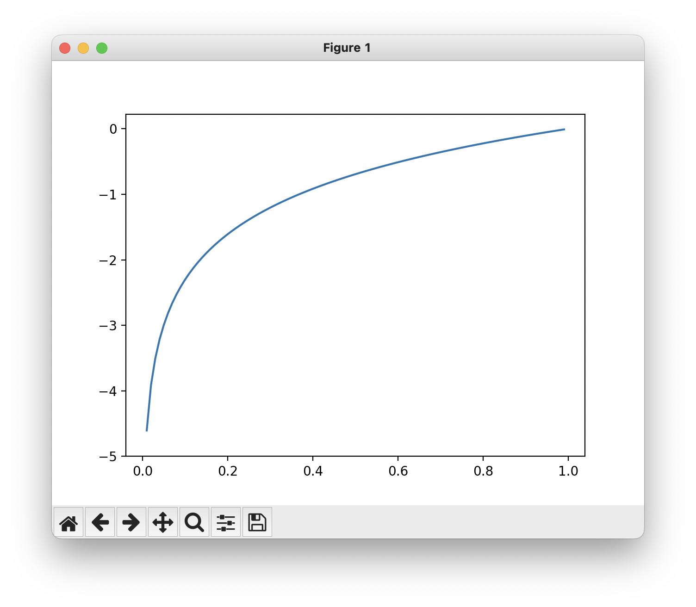

딥러닝에서 손실 함수(Loss Function)은 모델의 예측 값과 실제 값 사이의 차이를 수치로 표현하는 함수이다. 이 함수는 모델이 얼마나 잘(또는 못) 예측하는지 평가하는 척도가 된다.

손실 함수는 다음과 같은 역할을 한다.

1. 오차 측정: 모델의 출려과 실제 정답 간 차이를 계산하여, 모델의 성능을 정량적으로 평가한다. 
2. 모델 최적화: 손실 값을 최소화하기 위해 경사 하강법(Gradient Descent) 등의 최적화 알고리즘을 사용해 모델의 가중치를 업데이트 한다.
3. 손실 함수는 문제 유형에 따라 결정될 수 있다. 

## SSE(Sum of Squares for Error)

오차제곱합(SSE, Sum of Squares for Error)은 각 데이터 샘플의 예측 오차를 제곱하여 모두 합한 값이다. 

$$
E = \frac{1}{2}\sum_k(y_k - t_k)^2
$$

- $y_k$는 신경망의 출력
- $t_k$는 정답 레이블
- $k$는 데이터의 차원 수 

오차제곱합의 원소를 출력(예측 값)과 정답 레이블(참 값)의 차($y_k - t_k)$를 제곱한 후, 그 총합을 구한다.

```py
def sum_squares_error(y, t):
    return 0.5 * np.sum((y - t) ** 2)
```

2로 나눠주는 이유는 경사 하강법에서 발생할 수 있는 오류를 최소화하기 위함(델다 규칙)이다. 

## MSE(Mean Squared Error)

평균 제곱 오차(MSE)는 주로 회귀 문제에서 사용되는 손실 함수이다. 이 함수는 모델의 예측값과 실제 값 간의 오차를 제곱한 후, 모든 데이터에 대해 평균을 내어 계산한다.

$$
\text{MSE} = \frac{1}{N} \sum_{i=1}^{N} (y_i - t_i)^2 \newline
$$

- $N$은 데이터 샘플의 개수
- $y_i$는 $i$번째 샘플에 대한 모델의 예측값
- $t_i$는 $i$번째 샘플에 대한 실제 정답

```py
cost = torch.mean((hypothesis - y_train) ** 2)
```

## CEE(Cross Entropy Error)

교차 엔트로피 오차(CEE)는 주로 분류 문제에서 사용되는 손실 함수이다. 소프트맥스(Softmax) 함수와 함께 사용될 때 효과적이다.

CEE는 모델이 예측한 확률 분포와 실제 정답(원-핫 인코딩) 간의 차이를 정량적으로 평가하는 역할을 한다.

$$
E=-\sum_kt_k\log y_k
$$

- $y_k$는 신경망의 출력
- $t_k$는 정답 레이블
    - $t_k$는 정답에 해당하는 인덱스의 원소만 1이고 나머지는 0(원-핫 인코딩)이다.

즉, 정답일 때의 예측($t_k$가 1일 때의 $y_k$)의 자연로그를 계산하는 식이 된다. 예를 들어, 정답 레이블이 '2'라 가정하고, 이때의 신경망 출력이 0.6이라면, 교차 엔트로피 오차는 $-\log{0.6}=0.51$이 된다. 또한 같은 조건에서 신경망 출력이 $0.1$이라면 $-\log{0.1}=2.30$이 된다. 따라서 CEE는 정답일 때의 출력이 전체 값을 정하게 된다.

다음은 $y=\log{x}$의 자연로그 그래프이다.



$x$가 1일때 $y$는 0이되고, $x$가 0에 가까워질수록 $y$ 값은 점점 작아진다.

CEE도 정답에 해당하는 출력이 커질수록 0에 다가가며, 그 출력이 1일때 0이 된다.

```py
def cross_entropy_error(y, t):
    delta = 1e-7
    return -np.sum(t * np.log(y + delta))
```

$y$와 $t$는 넘파이 배열이다. `np.log()` 계산할 때 아주 작은 값 `delta`를 더해주는데, 이는 `np.log()` 함수에 0을 입력하면 마이너스 무한대를 뜻하는 `-inf`가 되어 더 이상 계산을 진행할 수 없기 때문이다. 아주 작은 값을 더해 0이 되지 않도록 한 것이다.

위 함수를 사용해보자.

```py
if __name__ == '__main__':
    t = [0, 0, 1, 0, 0, 0, 0, 0, 0, 0]
    y = [0.1, 0.05, 0.6, 0.0, 0.05, 0.1, 0.0, 0.1, 0.0, 0.0]
    print(cross_entropy_error(np.array(y), np.array(t))) 
    # 0.510825457099338

    y = [0.1, 0.05, 0.1, 0.0, 0.05, 0.1, 0.0, 0.6, 0.0, 0.0]
    print(cross_entropy_error(np.array(y), np.array(t))) 
    # 2.302584092994546
```

첫 번째 출력은 정답일 때 출력이 0.6인 경우로, 이때의 CEE는 약 0.51이다. 

두 번째 출력은 0.1로, 이때의 CEE는 2.3이다. 

따라서 결과(오차 값)이 더 작은 첫 번째가 정답일 가능성이 높다고 판단한다.