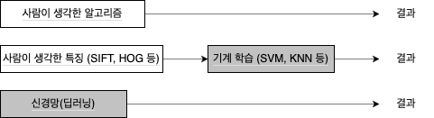

학습이란 훈련 데이터로부터 가중치 매개변수의 최적값을 자동으로 획득하는 것을 의미한다.

## 데이터 학습

데이터에서 학습한다는 의미는 가중치 매개변수의 값을 데이터를 통해 자동으로 결정한다는 것이다.

### 데이터 주도 학습

기계학습은 데이터에서 답을 찾고 데이터에서 패턴을 발견하고 데이터로 이야기를 만든다. 따라서 기계학습의 중심에는 **데이터**가 존재한다.

기계학습에서는 사람의 개입을 최소화하고 수집한 데이터로부터 패턴을 찾으려고 시도한다. 신경망과 딥러닝은 기존 기계학습에서 사용하던 방법보다 사람의 개입을 더욱 배제할 수 있게 해주는 특성을 지녔다.

'5'라는 숫자를 인식하는 프로그램을 구현한다고 하자. '5'를 제대로 분류하는 프로그램을 직접 설계하기는 어렵다. 대신 주어진 데이터를 활용해 **특징(feature)** 을 추출하고 그 특징의 패턴을 기계학습으로 학습하는 방법이 있다. 

여기서의 특징은 입력 데이터에서 본질적인 데이터를 정확하게 추출할 수 있도록 설계된 변환기를 가리킨다. 이미지의 특징은 보통 벡터로 기술하고, 컴퓨터 비전 분야에서는 SIFT, SURF, HOG 등의 특징을 사용한다. 이런 특징을 사용해 이미지 데이터를 벡터로 변환하고, 변환된 벡터를 가지고 지도 학습 방식의 대표 분류 기법인 SVM, KNN 등으로 학습할 수 있다.



신경망은 이미지를 "있는 그대로" 학습한다. 두 번째 접근 방식에서는 특징을 사람이 설계했지만, 신경망은 이미지에 포함된 중요한 특징까지도 기계가 학습해야 한다.

### 훈련 데이터 & 시험 데이터

기계학습 문제는 데이터를 **훈련 데이터(training data)** 와 **시험 데이터(test data)** 로 나눠 학습과 실험을 수행하는 것이 일반적이다. 우선 훈련 데이터만 사용해 학습하면서, 최적의 매개변수를 찾고, 시험 데이터를 사용해 훈련된 모델의 실력을 평가한다.

데이터셋 하나로만 매개변수의 학습과 평가를 수행하면 올바른 평가가 될 수 없다. 이렇게 한 데이터셋만 지나치게 최적화된 상태를 **오버피팅(overfiting)** 이라 한다.

## 손실 함수

신경망에서는 '하나의 지표'를 기준으로 최적의 매개변수 값을 탐색한다. 이 지표를 **손실 함수(loss function)** 이라 한다. 일반적으로 오차제곱합과 교차 엔트로피 오차를 사용한다.

### 미니배치 학습

훈련 데이터에 대해 손실 함수 값을 구하고, 그 값을 최대한 줄여주는 매개변수를 찾아야 한다. 이렇게 하려면 모든 훈련 데이터를 대상으로 손실 함수 값을 구해야 하며, 이로부터 계산한 100개의 손실 함수 값들의 합을 지표로 삼는다.

훈련 데이터 모두에 대한 손실 함수의 합을 구해보자. 예를 들어, 교차 엔트로피 오차는 다음 식으로 나타낼 수 있다.

$$
E=-\frac{1}{N}\sum_n\sum_kt_{nk}\log y_{nk}
$$

데이터가 $N$개라면 $t_{nk}$는 $n$번째 데이터의 $k$번째 값을 의미한다. 마지막에 $N$으로 나누어 정규화하고 있다. 즉, 이렇게 함으로써 '평균 손실 함수'를 구하는 것이다. 이렇게 평균을 구하면 훈련 데이터 개수와 상관없이 언제나 통일된 지표를 얻을 수 있다.

데이터가 많은 경우 모든 데이터를 대상으로 손실 함수의 합을 구하려면 시간이 걸린다. 이런 경우 데이터 일부를 추려 전체의 '근사치'로 이용할 수 있다. 

신경망에서도 훈련 데이터로부터 일부만 골라 학습을 수행한다. 이 일부를 **미니배치(mini-batch)** 라 한다. 가령 60,000장의 훈련 데이터에 100장을 임의로 뽑아 그 100장만 사용하여 학습하는 것이다. 이러한 학습 방법을 **미니배치 학습**이라 한다.

훈련 데이터에서 무작위로 10장을 빼내기 위해 `np.random.choice()` 함수를 사용한다.

```py
>>> np.random.choice(60000,10)
array([25045, 22336,  2169, 24419, 58882, 39508,  9145,   487,  1313,
       38852])
```

### (배치용) 교차 엔트로피 오차 구현

배치 데이터를 지원하는 교차 엔트로피를 구현해보자.

```py
def cross_entropy_error(y, t):
    if y.ndim == 1:
        t = t.reshape(1, t.size)
        y = y.reshape(1, y.size)
    batch_size = y.shape[0]
    return -np.sum(t * np.log(y + 1e-7)) / batch_size
```