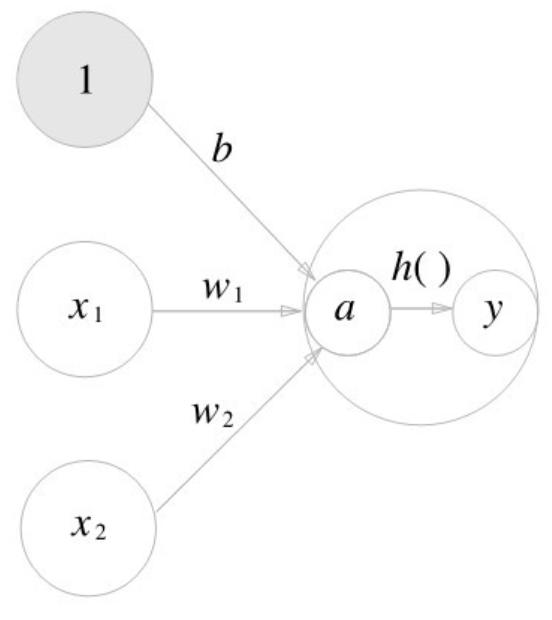
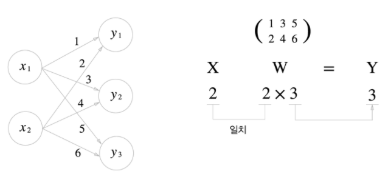
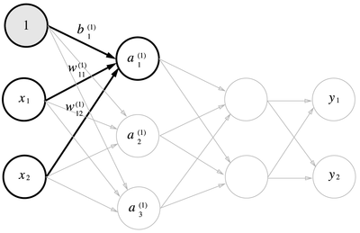

복잡한 처리는 퍼셉트론으로 (이론상) 표현할 수 있다. 그러나 가중치를 설정하는 작업은 수동으로 해주어야 한다. 가중치 매개변수의 적절한 값을 데이터로부터 자동으로 학습하는 능력은 신경망의 중요한 성질이다.

 ## 신경망
 
 $x_1$과 $x_2$ 두 신호를 입력받아 $y$를 출력하는 퍼셉트론이 있다고 하자. 이 퍼셉트론을 수식으로 나타내면

 $$
 y = \begin{cases} 0 \space (b + w_1x_1 + w_2x_2 \le 0) \\ 1 \space (b + w_1x_1 + w_2x_2 \gt 0) \end{cases}
 $$ 

$b$는 편향을 나타내는 매개변수로, 뉴런이 얼마나 쉽게 활성화되는지를 제어한다. $w_1$과$w_2$는 가중치를 나타내는 매개변수로, 각 신호의 영향력을 제어한다.

더 간결히 표현하기 위해 조건 분기의 동작을 하나의 함수로 나타내보자. 이 함수를 $h(x)$라 하면 다음과 같이 표현할 수 있다.

$$
y = h(b + w_1x_1 + w_2x_2) \\ h(x) = \begin{cases} 0 \space (x \le 0) \\ 1 \space (x \gt 0) \\ \end{cases}
$$

$h(x)$ 함수는 입력이 0을 넘으면 1을 반환하고, 그렇지 않으면 0을 반환한다.

## 활성화 함수

이처럼 입력 신호의 총합을 출력 신호로 변환하는 함수를 **활성화 함수**라 한다. 활성화 함수는 입력 신호의 총합이 활성화를 일으키는지 정하는 역할을 한다.

$$
a = b+w_1x_1+w_2x_2 \\ y = h(a)
$$

가중치가 달린 입력 신호와 편향의 총합을 계산하고, 이를 $a$라 한다. 그리고 $a$를 함수 $h()$로 전달해 $y$를 출력한다.



가중치 신호를 조합한 결과가 $a$라는 노드가 되고, 활성화 함수 $h()$를 통과해 $y$라는 노드로 변환되는 과정을 나타낸다.

### 시그모이드

시그모이드 함수는 곡선이며 입력에 따라 출력이 연속적으로 변화한다. 그러나 계단 함수는 0을 경계로 바뀐다. 시그모이드 함수의 부드러움은 신경망 학습에서 중요한 역할을 한다.

퍼셉트론에서는 뉴런 사이 0과 1이 흘렀다면, 신경망에서는 연속적인 실수가 흐르게 된다.

두 함수의 공통점은 입력이 작을 때 출력은 0에 가깝고(혹은 0), 입력이 커지면 출력이 1에 가까워지는(혹은 1) 구조이다.

### 비선형 함수

계단 함수와 시그모이드 함수는 모두 비선형 함수이다.

> 함수에 무언가 입력했을 때 출력이 입력의 상수배만큼 변하는 함수를 **선형 함수**라 한다. 수식으로는 $f(x)=ax+b$이고, $a$와 $b$는 상수이다.

신경망에서 활성화 함수로 비선형 함수를 사용해야 한다. 선형 함수를 이용하면 신경망의 층을 깊게 유지하는 의미가 없어지기 때문이다.

최근 ReLU(Rectified Linear Unit) 함수를 주로 이용한다.

## 다차원 배열 계산

숫작가 한 줄로 늘어선 것이나 직사각형으로 늘어놓은 것, 3차원으로 늘어놓은 것이나 $N$ 차원으로 나열하는 것을 통틀어 다차원 배열이라 한다.

배열의 차원 수는 `np.ndim()` 함수로 확인할 수 있다. 또한 배열의 형상은 `shape`로 알 수 있다.

2차원 배열은 행렬(matrix)라 하고, 배열의 가로 방향을 행(row), 세로 방향을 열(column)이라 한다.

### 행렬 곱

행렬의 곱은 `np.dot()`으로 계산한다. `np.dot()`은 입력이 1차원 배열이면 벡터를, 2차원 배열이면 행렬 곱을 계산한다.

여기서 주의할 점은 `np.dot(a, b)`와 `np.dot(b, a)`가 다르다는 점이다.

### 신경망에서의 행렬 곱

행렬 곱으로 신경망의 계산을 수행한다. 다음 신경망은 편향과 활성화 함수를 생략하고 가중치만 갖는다고 하자.



```py
>>> x = np.array([1, 2])
>>> x
array([1, 2])
>>> x.shape
(2,)
>>> w = np.array([[1, 3, 5],[2, 4, 6]])
>>> w
array([[1, 3, 5],
       [2, 4, 6]])
>>> np.dot(x, w)
array([ 5, 11, 17])
```

다차원 배열의 스칼라곱을 구해주는 `np.dot()` 함수를 사용하면 한 번에 결과를 계산할 수 있다.

## 3층 신경망 구성

1층 가중치 부분은 다음과 같이 나타낼 수 있다.



```py
X = np.array([1.0, 0.5])
W1 = np.array([[0.1, 0.3, 0.5], [0.2, 0.4, 0.6]])
B1 = np.array([0.1, 0.2, 0.3])

print(W1.shape)
print(X.shape)
print(B1.shape)

A1 = np.dot(X, W1) + B1
```

은닉층에서의 가중치 합(가중치와 편향의 총합)을 $a$로 표기하고, 활성화 함수 $h(x)$로 변환된 신호를 $z$로 표기한다. 활성화 함수로 시그모이드 함수를 사용한다.

```py
Z1 = sigmoid(A1)

print(A1)
print(Z1)
```

이번에는 1층에서 2층으로 가는 과정을 구현해보자.

```py
W2 = np.array([[0.1, 0.4], [0.2, 0.5], [0.3, 0.6]])
B2 = np.array([0.1, 0.2])

print(Z1.shape)
print(W2.shape)
print(B2.shape)

A2 = np.dot(Z1, W2) + B2
Z2 = sigmoid(A2)
```

`Z1`이 2층의 입력으로 전달되는 것을 제외하면 이전과 거의 동일하다. 

마지막으로 출력층을 구해보자. 활성화 함수로 항등 함수(입력 그대로를 출력하는 함수)를 사용했다.

```py
def identity_function(x):
    return x

W3 = np.array([[0.1, 0.3], [0.2, 0.4]])
B3 = np.array([0.1, 0.2])

A3 = np.dot(Z2, W3) + B3
Y = identity_function(A3)
```

### 출력층 설계

신경망은 분류와 회귀 모두에 이용할 수 있다. 어떤 문제냐에 따라 출력층에서 사용되는 활성화 함수가 달라진다. 일반적으로 회귀에는 항등 함수를, 2클래스 분류에는 시그모이드 함수를, 다중 클래스 분류에는 소프트맥스 함수를 사용한다.

> 기계학습 문제는 분류(classification)과 회귀(regression)로 나뉜다. 분류는 데이터가 어느 클래스에 속하느냐의 문제이며, 회귀는 입력 데이터에서 (연속적인) 수치를 예측하는 문제이다.

출력층의 뉴런 수는 풀려는 문제에 맞게 적절히 정해야 한다. 분류에서는 분류하고 싶은 클래스 수로 설정하는 것이 일반적이다. 예를 들어, 이미지를 숫자 0부터 9 중 하나로 분류하는 문제라면 출력층의 뉴런을 10개로 설정한다.
