## 퍼셉트론이란?

퍼셉트론은 다수의 신호를 입력받아 하나의 신호를 출력한다. 퍼센트론 신호는 '흐른다/안 흐른다(1 또는 0)'의 두 가지 값을 가질 수 있다.

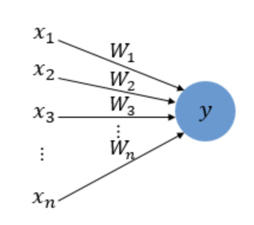

$x$는 입력값을 의미하며, $W$는 가중치, $y$는 출력값이다. 그림 안의 원은 인공 뉴런에 해당한다. 각 인공 뉴런에 보내진 입력값 $x$는 각각의 가중치 $W$와 함께 인공 뉴런에 전달된다.

각각의 입력엔 가중치가 존재하는데, 이때 가중치 값이 크면 클수록 해당 입력값이 중요하다는 의미가 된다. 

각 입력값이 곱해져 인공 뉴런에 보내지고, 각 입력값과 그에 해당되는 가중치 곱의 전체 합이 임계치(threshold)를 넘으면 종착지에 있는 인공 뉴런은 출력 신호로 1을 출력하고, 그렇지 않으면 0으로 출력한다. 

이런 함수를 계단 함수(step function)이라 한다.

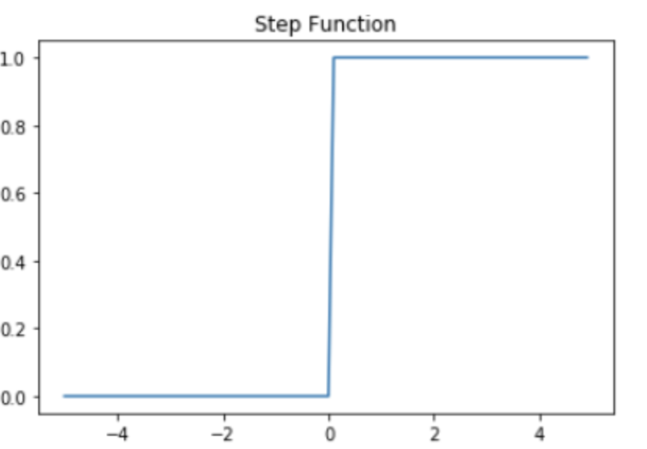

계단 함수에 사용된 임계치 값을 수식으로 표현할 때는 보통 $\theta$로 표현한다.


$$
if \sum_i^{n} W_{i}x_{i}\ ≥ \theta → y=1 \\ if \sum_i^{n} W_{i}x_{i}\ < \theta → y=0
$$

위 식에서 $\theta$를 좌변으로 넘기고 $b$(bias)로 표현할 수도 있다. $b$ 또한 퍼셉트론의 입력으로 사용된다. 보통 그림으로 표현할 때는 입력값이 1로 고정되고 편향 $b$가 곱해지는 변수로 표현된다.

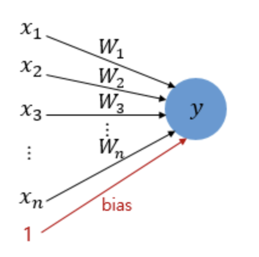

$$
if \sum_i^{n} W_{i}x_{i} + b ≥ 0 → y=1 \\ if \sum_i^{n} W_{i}x_{i} + b < 0 → y=0
$$

편의상 편향 $b$는 그림이나 수식에서 생략될 수 있지만, 실제로는 편향 $b$ 또한 딥러닝이 최적의 값을 찾아야 할 변수 중 하나다.

이렇게 뉴런에서 출력값을 변경시키는 함수를 활성화 함수(activation function)이라 한다. 초기에는 활성화 함수로 계단 함수를 사용했으나, 점차 다양한 활성화 함수를 사용했다. 시그모이드 함수나 소프트맥스 함수 등이 있다.

## 단층 퍼셉트론(SLP, Single-Layer Perceptron)

위 퍼셉트론을 단층 퍼셉트론이라 한다. 단층 퍼셉트론은 값을 보내는 단계와 값을 받아 출력하는 두 단계로만 이루어진다. 이때 각 단계를 층(layer)라 하며, 이 두 개의 입력층을(input layer)와 출력층(output layer)라 한다.

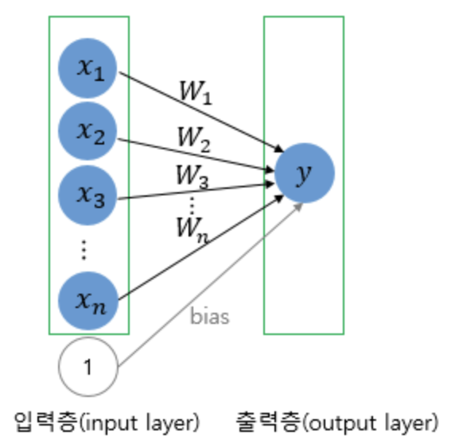

단층 퍼셉트론을 이용해 AND, NAND, OR 게이트를 구현할 수 있다. 게이트 연산에 쓰이는 것은 두 개의 입력과 하나의 출력이다.

### AND 게이트

AND 게이트의 경우 두 개의 입력값이 모두 1인 경우 출력값이 1이 나오는 구조이다.

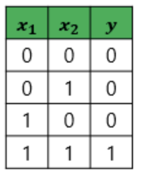

단층 퍼셉트론 식을 통해 AND 게이트를 만족하는 두 개의 가중치와 편향 값은 [0.5, 0.5, -0.7] 또는 [1.0, 1.0, -1.0] 등이 있을 것이다.

```py
def AND_gate(x1, x2):
    w1 = 0.5
    w2 = 0.5
    b = -0.7
    result = x1*w1 + x2*w2 + b
    if result <= 0:
        return 0
    else:
        return 1
```

위 함수에 AND 게이트 입력값을 모두 넣어보면 두 개의 입력값이 1인 경우에만 1을 출력한다.

### NAND 게이트

NAND 게이트는 두 개의 입력값이 모두 1인 경우 출력값이 0이 나오는 구조이다.

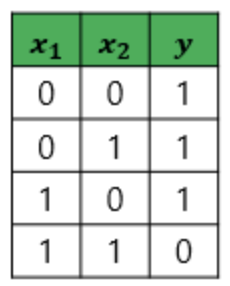

[-0.5, -0.5, 0.7]을 단층 퍼셉트론 식에 넣으면 NAND 게이트를 충족한다.

```py
def NAND_gate(x1, x2):
    w1 = -0.5
    w2 = -0.5
    b = 0.7
    result = x1*w1 + x2*w2 + b
    if result <= 0:
        return 0
    else:
        return 1
```

### OR 게이트

OR 게이트는 두 입력값이 모두 0인 경우에 0이 출력되고 나머지는 1이 출력된다.

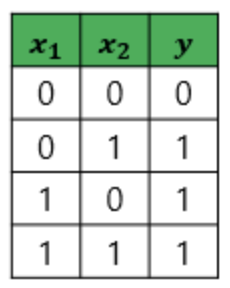

[0.6, 0.6, -0.5]를 선택하면 OR 게이트를 충족한다.

```py
def OR_gate(x1, x2):
    w1 = 0.6
    w2 = 0.6
    b = -0.5
    result = x1*w1 + x2*w2 + b
    if result <= 0:
        return 0
    else:
        return 1
```

### XOR 게이트

단층 퍼셉트론으로는 XOR 게이트 구현이 불가능하다. XOR은 입력값 두 개가 서로 다른 값을 갖고 있을 때에만 출력값에 1이 되고, 입력값 두 개가 서로 같은 값을 가지면 출력값이 0이 되는 게이트이다.

단층 퍼셉트론은 직선 하나로 두 영역을 나눌 수 있는 문제에 대해서만 구현이 가능하다.

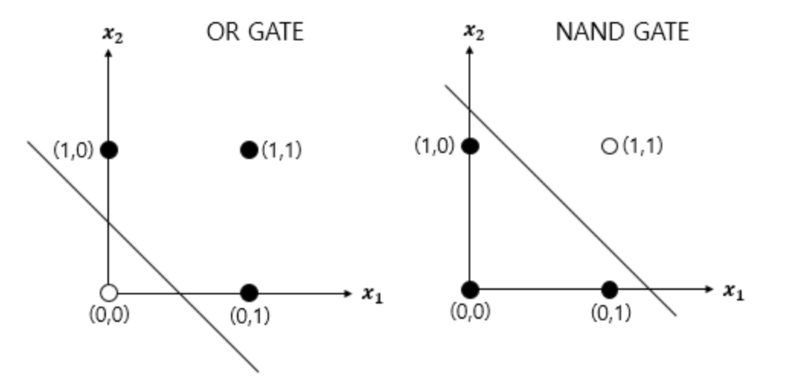

XOR 게이트를 보자.

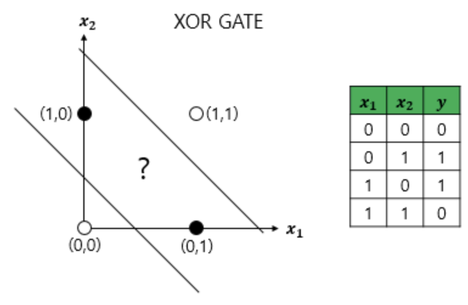

하얀색 원과 검은색 원을 직선 하나로 나누는 것은 불가능하다. 즉, 단층 퍼셉트론으로 XOR 게이트를 구현하는 것은 불가능하다. 단층 퍼셉트론은 선형 영역에 대해서만 분리가 가능하다.

XOR 게이트는 직선이 아닌 곡선(비선형)으로 분리하면 구현이 가능해진다.

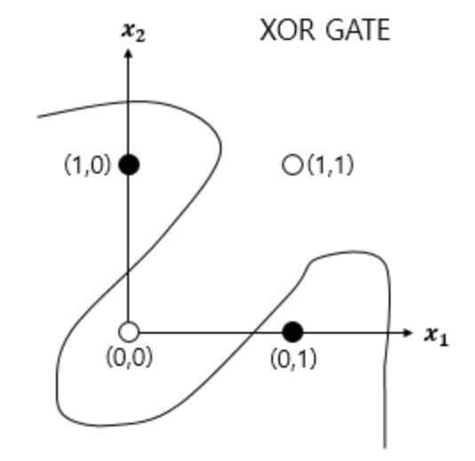

## 다층 퍼셉트론(MLP, Multi-Layer Perceptron)

XOR 게이트는 AND, NAND, OR 게이트를 조합해 만들 수 있다. 단층 퍼셉트론은 입력층과 출력층만 존재하지만, 다층 퍼셉트론은 중간에 층을 더 추가하였다. 이렇게 입력층과 출력층 사이 존재하는 층을 은닉층(hidden layer)라 한다.

다음은 AND, NAND, OR을 조합해 XOR 게이트를 구현한 다층 퍼셉트론이다.

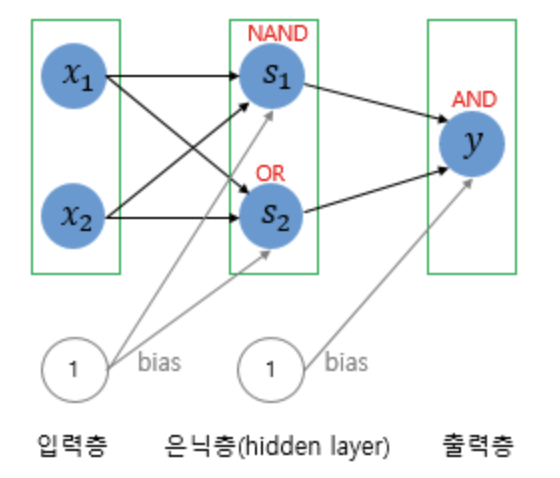

XOR은 은닉층 1개로 문제를 해결할 수 있었지만, 다층 퍼셉트론은 은닉층이 1개 이상 가질 수 있다. 즉, XOR 문제보다 더 복잡한 문제를 해결하기 위해 다층 퍼셉트론 중간에 많은 은닉층을 더 추가할 수 있다.

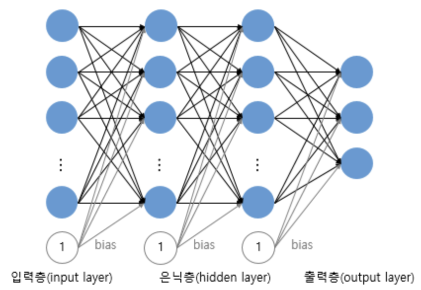

위와 같이 은닉층이 2개 이상인 신경망을 **심층 신경망(DNN, Deep Neural Network)** 라 한다.

지금까지 가중치를 수동으로 찾았으나, 이제는 기계가 가중치를 스스로 찾아내도록 자동화를 시켜야 한다. 이는 머신러닝에서 학습(training) 단계에 해당된다. 학습에는 손실 함수(loss function)와 옵티마이저(optimizer)를 사용한다. 학습을 시키는 인공 신경망이 심층 신경망일 경우 이를 딥 러닝(deep learning)이라 한다.

## References

- [06-02 퍼셉트론(Perceptron)](https://wikidocs.net/60680)