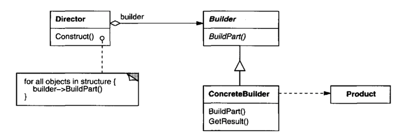
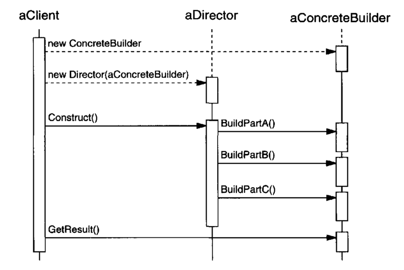

복잡한 객체를 생성하는 방법과 표현하는 방법을 정의하는 클래스를 별도로 분리하여, 서로 다른 표현이라도 이를 생성할 수 있는 동일한 절차를 제공한다.

## Motivation

문서 작성 애플리케이션에서 PDF나 HTML 형식의 문서를 생성할 수 있는 기능이 필요하다고 하자. 문서 객체는 여러 설정 항목(제목, 내용, 스타일 등)을 필요로 하며, 이러한 설정은 객체 생성 시마다 다를 수 있다. 이들을 생성자 매개변수로 전달하면 코드가 매우 복잡해질 가능성이 있으며, 각 문서 형식마다 서로 다른 생성 방식을 적용해야 하므로 코드의 유지보수가 어려워진다.

빌더 패턴을 사용하면 문서 객체 생성 과정을 단계별로 나누고, 각 단계마다 필요한 컴포넌트를 설정할 수 있다. 따라서 가독성과 유지보수성이 크게 향상된다.

## Applicability

- 복잡 객체를 만들 때, 객체를 구성하는 컴포넌트가 무엇인지, 이 컴포넌트들을 표현(조립)하는 방식에 신경쓰고 싶지 않을 때 
- 합성할 객체들의 표현이 서로 다르더라도 생성 절차에서 이를 지원해야 할 때

## Structure



- `Builder`: `Product` 객체의 일부 요소들을 생성하기 위한 추상 인터페이스를 정의
- `ConcreteBuilder`: `Builder` 클래스에 정의된 인터페이스를 구현하며, 제품의 부품들을 모아 빌더를 복합
- `Director`: `Builder` 인터페이스를 사용하는 객체를 합성
- `Product`: 생성할 복합 객체를 표현한다. `ConcreteBuilder`는 제품 내부의 표현을 구축하고 복합 객체가 어떻게 구성되는지에 관한 절차를 정의


## Collaborations

- 사용자는 `Director` 객체를 생성하고, 이렇게 생성한 객체를 자신이 원하는 `Builder` 객체로 합성해 나간다.
- 제품의 일부가 구축될(built) 때마다 `Director`는 `Builder`에 통보한다.
- `Builder`는 `Director`의 요청을 처리해 제품에 부품을 추가한다.
- 사용자는 `Builder`에서 제품을 검색한다.



## Consequences

1. **제품에 대한 내부 표현을 다양하게 변화할 수 있다.** 

    빌더를 사용하면 제품이 어떤 컴포넌트에서 복합되는지, 그리고 각 컴포넌트들의 표현 방법이 무엇인지 가릴 수 있게 된다. 즉, 어떤 컴포넌트로 전체 제품을 복합하고, 그 컴포넌트들이 어떤 타입으로 구현되는지 알고 있는 쪽은 빌더 뿐이다.
2. **생성과 표현에 필요한 코드를 분리한다.** 

    빌더 패턴을 사용하면 복합 객체를 생성하고 복합 객체 내부 표현 방법을 별도의 모듈로 정의할 수 있다.
3. **복합 객체를 생성하는 절차를 좀 더 세밀하게 나눌 수 있다.** 

    빌더 패턴은 `Director`의 통제 하에 하나씩 내부 컴포넌트들을 만들어 나간다. `Director`가 빌더에서 만든 전체 복합 객체를 되돌려 받을 때까지 제품 복합 과정은 계속된다. 따라서 `Builder` 클래스의 인터페이스에는 이 제품을 생성하는 과정 자체가 반영되어 있다.

## Implementation

1. **조합과 구축에 필요한 인터페이스를 정의한다.** 

    빌더는 단계별로 제품들을 생성한다. 이를 위해 모든 종류의 제품을 생성하는 데 필요한 일반화된 연산을 정의한다. 
2. **`Builder`에 있는 메서드에 대해서는 구현을 제공하지 않는 것이 일반적이다.** 

    빌더에 정의된 메서드를 가상함수로 정의하지 않고 구현부를 비워두는 것이 바람직하다. 이는 서브클래스에 필요한 메서드만 재정의하기 위함이다. 

## Sample Code

`CreateMaze()` 멤버 함수를 수정해 `MazeBuilder` 클래스의 한 인스턴스 매개변수로 받아 처리하도록 만든다.

`MazeBuilder` 클래스를 통해 미로를 복합하는 데 필요한 인스턴스를 정의한다. 

```cpp
class MazeBuilder {
public:
    virtual void BuildMaze() { }
    virtual void BuildRoom(int room) { }
    virtual void BuildDoor(int roomFrom, int roomTo) { }

    virtual Maze* GetMaze() { return 0; }
protected:
    MazeBuilder();
};
```

이 인터페이스에 정의된 연산들을 통해 미로와 방 번호를 갖는 방과 방들 사이 문을 생성할 수 있다. `MazeBuilder`의 서브클래스들은 각자 가신의 방식으로 구축한 미로를 반환하도록 이 연산을 재정의한다.

미로를 실제 만드는 연산인 `MazeBuilder()`에 대해서는 어떤 구현도 하지 않는다. 또한 순수 가상 함수로 정의하지 않는다. 이는 `Builder`의 서브클래스에서 관심이 있을 때만 이들 연산을 재정의할 수 있도록 하기 위함이다.

`CreateMaze()` 멤버 함수에서 `MazeBuilder` 인스턴스를 매개변수로 받아들이도록 한다.

```cpp
Maze* MazeGame::CreateMaze(MazeBuilder& builder) {
    builder.BuildMaze();

    builder.BuildRoom(1);
    buiIder.BuildRoom(2);
    builder.BuildDoor(1, 2);

    return builder.GetMaze();
}
```

빌더 패턴은 객체가 어떻게 생성되는지 캡슐화하는데, 이는 `MazeBuilder`에 정의된 인터페이스를 통해 이루어진다. `MazeBuilder`에 정의된 연산들을 보면 어떤 종류의 미로인지, 어떤 방법으로 만들어지는지 전혀 알 수 없다. 연산의 이름으로 어떤 종류의 컴포넌트들을 생성할 수 있는지를 표현할 뿐이다. 

```cpp
Maze* MazeGame::CreateComplexMaze(MazeBuilder& builder) {
    builder.BuildRoom(1);
    // ...
    buiIder.BuildRoom(1001);

    return builder.GetMaze();
}
```

`MazeBuilder`의 주 목적은 미로 자체를 만들지 않고, 미로를 생성하는 인터페이스를 정의하는 것이다. 그렇기 때문에 실제 컴포넌트들이 어떻게 만들어지는지에 대한 구현은 정의하지 않는다. 해당 구현은 `MazeBuilder`의 서브클래스에 들어있게 된다.

`StandardMazeBuilder` 서브클래스를 만들어보자. 이 미로의 특징은 `_currentMaze` 변수에 자신이 구축한 미로에 대한 매개변수를 관리하도록 하는 것이다.

```cpp
class StandardMazeBuilder : public MazeBuilder {
public:
    StandardMazeBuilder();

    virtual void BuildMaze();
    virtual void BuildRoom(int);
    virtual void BuildDoor(int, int);

    virtual Maze* GetMaze();
private:
    Direction CommonWall(Room*, Room*);
    Maze* _currentMaze;
};
```

`CommonWall()`은 두 방 사이 있는 벽의 방향을 결정하는 것이다. `StandardMazeBuilder` 클래스의 생성자에서 `_currentMaze`를 초기화한다.

```cpp
StandardMazeBuilder::StandardMazeBuilder() {
    _currentMaze = 0;
}
```

`BuildMaze`로 `Maze`의 인스턴스를 생성해 `_currentMaze`로 설정하고, 다른 연산을 통해 컴포넌트들을 생성, 복합 후 `GetMaze()`로 그 결과를 사용자에게 되돌려준다.

```cpp
void StandardMazeBuilder::BuildMaze() {
    _currentMaze = new Maze;
}

Maze* StandardMazeBuilder::GetMaze(){
    return _currentMaze;
}
```

`BuildRoom()`은 방을 생성하고 방 주위의 벽을 만드는 연산이다.

```cpp
void StandardMazeBuilder::BuildRoom(int n) {
    if (!_currentMaze->RoomNo(n)) {
        Room* room = new Room(n);       // 방 생성
        _currentMaze->AddRoom(room);    // 방 미로에 추가

        room->SetSide(North, new Wall);
        room->SetSide(South, new Wall);
        room->SetSide(East, new Wall);
        room->SetSide(West, new Wall);
    }
}
```

방 사이 문을 만들기 위해 `StandardMazeBuilder`는 미로에 속한 방 두 개를 찾아 이들 사이 연결된 부분에 문을 만든다. 

```cpp
void StandardMazeBuilder::BuildDoor(int n1, int n2) {
    Room* r1 = _currentMaze->RoomNo(n1);
    Room* r2 = _currentMaze->RoomNo(n2);
    Door* d = new Door(r1, r2);

    r1->SetSide(CommonWall(r1,r2), d);
    r2->SetSide(CommonWall(r2,rl), d);
}
```

사용자는 `StandardMazeBuilder`와 연결된 `CreateMaze()` 함수를 사용할 수 있다.

```cpp
Maze* maze;
MazeGame game;
StandardMazeBuilder builder;

game.CreateMaze(builder);
maze = builder.GetMaze();   // builder를 매개변수로 넘겨 builder를 이용할 수 있도록 한다.
```

미로를 생성하지 않고 생성된 서로 다른 종류의 컴포넌트의 수를 알아내기 위한 `CountingMazebuilder`를 만들어보자.

```cpp
class CountingMazeBuilder : public MazeBuilder {
public:
    CountingMazeBuilder();

    virtual void BuildMaze();
    virtual void BuildRoom(int);
    virtual void BuildDoor(int, int);
    virtual void AddWall(int, Direction);

    void GetCounts(int&, int&) const;
private:
    int _doors;
    int _rooms;
};
```

생성자는 방과 문의 수를 초기화한다. `CountingMazeBuilder` 클래스는 `MazeBuilder` 클래스에 정의된 추상 연산 각각에 대한 구현을 제공하는데, 이 구현의 동작 원리는 방과 문의 개수를 나타내는 멤버 변수를 증가시키는 것이다.

```cpp
CountingMazeBuilder::CountingMazeBuilder () {
    _rooms = _doors = 0;
}

void CountingMazeBuilder::BuildRoom (int){
    _rooms++;
}

void CountingMazeBuilder::BuildDoor (int, int) {
    _doors++;
}

void CountingMazeBuilder::GetCounts (int& rooms, int& doors) const {
    rooms = _rooms;
    doors = _doors;
}
```

`CountingMazeBuilder`를 사용하는 방법은 다음과 같다.

```cpp
int rooms, doors;
MazeGame game;
CountingMazeBuilder builder;

game.CreateMaze(builder);
builder.GetCounts(rooms, doors);
cout << "The maze has "
     << rooms << " rooms and"
     << doors << " doors" << endl;
```