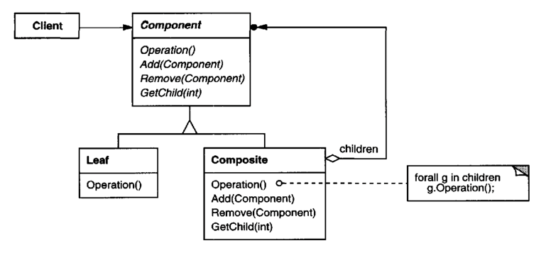
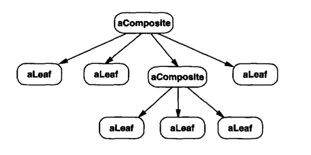

부분과 전체의 계층을 표현하기 위해 객체들을 모아 트리 구조로 구성한다. 사용자로 하여금 개별 객체와 복합 객체를 모두 동일하게 다룰 수 있도록 하는 패턴이다.

## Motivation

파일 시스템에는 파일과 디렉터리가 존재하며, 디렉터리는 파일뿐만 아니라 다른 디렉터리도 포함할 수 있다. 이러한 관계를 구현할 때, 파일과 디렉터리를 다르게 다루면 코드가 복잡해지고, 이를 관리하는 데 불편함이 발생한다. 

컴포지트 패턴을 사용하면 파일과 디렉터리를 동일하게 처리할 수 있다. 디렉터리는 파일과 다른 디렉터리를 자식 객체로 가지며, 이를 재귀적으로 처리할 수 있다. 새로운 객체가 추가될 때도 확장성이 높아진다.

## Applicability

- 부분 - 전체의 객체 계통을 표현하고 싶을 때
- 사용자가 객체의 합성으로 생긴 복합 객체와 개별 객체 사이의 차이를 알지 않고도 자기 일을 할 수 있도록 만들고 싶을 때

## Structure



전형적인 컴포지트 객체 구조는 다음과 같다.



- `Component`: 집합 관계에 정의될 모든 객체에 대한 인터페이스를 정의한다. 모든 클래스에 해당하는 인터페이스에 대해서는 공통의 행동을 구현한다. 전체 클래스에 속한 컴포넌트들을 관리하는 데 필요한 인터페이스를 정의한다. 순환 구조에서 컴포넌트들을 포함하는 전체 클래스로 접근하는 데 필요한 인터페이스를 정의하며, 적절하다면 그 인터페이스를 구현한다.
- `Leaf`: 가장 밑단의 객체, 즉 자식이 없는 객체를 의미한다. 객체 합성에 가장 기본이 되는 객체의 행동을 정의한다.
- `Composite`: 자식이 있는 컴포넌트에 대한 행동을 정의한다. 자신이 복합하는 요소들을 저장하면서, `Component` 인터페이스에 정의된 자식 관련 연산을 구현한다.
- `Client`: `Component` 인터페이스를 통해 복합 구조 내 객체들을 조작한다.

## Collaborations

- 사용자는 복합 구조 내 객체 간 상호작용을 위해 `Component` 클래스 인터페이스를 사용한다. 요청받은 대상이 `Leaf` 인스턴스면 자신이 정의한 행동을 직접 수행하고, 대상이 `Composite`면 자식 객체들에게 요청을 위임한다. 

## Consequences

1. **기본 객체와 복합 객체로 구성된 하나의 일관된 클래스 계통을 정의한다.**
2. **사용자의 코드가 단순해진다.**

    사용자 코드는 복합 구조이나 단일 객체와 동일하게 다루는 코드로 작성된다. 즉, 사용자는 객체의 특성이 복합 구조인지 단일 구조인지 모르고 개발할 수 있다.
3. **새로운 종류의 컴포넌트를 쉽게 추가할 수 있다.**

    새롭게 정의된 `Composite`나 `Leaf`의 서브클래스들은 기존에 존재하는 구조들과 독립적으로 동작이 가능하게 된다. 
4. **설계가 지나치게 범용성을 많이 가진다.**

    새로운 컴포넌트를 추가할 때의 단점은 복합체 컴포넌트에 제약을 가하기 힘들다는 것이다. 이런 경우 런타임 점검이 필요하다.

## Implementation

1. **부모 객체에 대한 명확한 참조자.**

    자식 컴포넌트에서 부모를 가리키는 참조자를 관리하면 복합체 구조의 관리를 단순화할 수 있다. 부모에 대한 참조자는 구조를 거슬러 올라가거나 컴포넌트를 하나 삭제하는 과정을 단순화시킨다. 복합 구조에서 추가나 삭제가 일어날 때만 컴포넌트의 부모를 변경하는데, 이로써 `Composite` 클래스의 `Add()` 및 `Remove()` 연산에서만 부모에 대한 참조자를 관리하면, 이를 상속하는 서브클래스에서는 이 코드를 상속받아 자동으로 부모에 대한 참조자를 관리할 수 있다.

    부모 객체에 대한 참조자는 보통 `Component` 클래스에 두는데, `Leaf` 클래스와 `Composite` 클래스는 이 `Component`를 상속받고 있으므로, 실제로 두 클래스 모두 이 참조자를 관리하는 셈이다.
2. **컴포넌트 공유.**

    컴포넌트를 공유하는 것은 메모리의 저장 공간을 줄일 수 있다. 그러나 컴포넌트가 하나 이상의 부모를 갖는다면 컴포넌트를 공유하기 어렵다. 해결책 중 하나는 자식이 여러 부모를 갖게 하는 것이다. 그러나 메시지를 전달할 때 어떤 부모에게 전달해야 할 지 애매할 수 있다. 
3. **`Component` 인터페이스를 최대화.**

    컴포지트 패턴의 주 목표 중 하나는 사용자가 어떤 `Leaf`나 `Composite` 클래스가 존재하는지 모르도록 하는 것이다. 이 목표를 달성하기 위해 `Component` 클래스는 `Composite`와 `Leaf`에 정의된 모든 공통 연산을 다 정의하고 있어야 한다. `Component` 클래스는 이 연산들에 대한 기본 구현을 제공하고, `Leaf`와 `Composite` 클래스가 이를 재정의한다. 
4. **자식을 관리하는 연산 선언.**

    컴포지트 패턴에서 매우 중요한 관심사는 `Composite` 클래스 계통 내 어느 클래스에 `Add()`, `Remove()` 연산을 선언할 것인가를 결정하는 것이다.

    - 자식을 관리하는 인터페이스를 클래스 계통 최상위 클래스에 정의하면, 서브클래스 모두에게 동일한 인터페이스가 유지되어 이를 사용하는 사용자에게 인터페이스의 투명성을 부여할 수 있다. 반대로 사용자가 `Leaf` 클래스의 인스턴스에게 `Add()`나 `Remove()` 연산을 호출하는 의미없는 행동을 하지 않도록 안정성 유지를 위한 비용을 지불해야 한다.
    - `Composite` 클래스에만 자식을 관리하는 연산을 정의한다면, 이를 사용하는 사용자는 `Leaf` 클래스의 인스턴스에 이런 연산을 요청하지 않을 것이므로 안정성은 보장받는다. 그러나 `Leaf` 클래스와 `Composite` 클래스가 서로 다른 인터페이스를 갖게 되므로 사용자는 이를 동일한 대상으로 간주하고 사용할 수 없으므로 코드가 복잡해질 수 있다.
5. **자식 사이 순서 정하기.**

    `Composite` 클래스의 자식들 간 순서를 정의할 때가 있다. 인터페이스를 설계 시 자식들의 순서를 관리할 수 있도록 주의를 기울여야 한다.
6. **성능 개선을 위한 캐싱.** 

    복합 구조 내부를 수시로 순회하고 탐색해야 한다면, `Composite` 클래스는 자식을 순회하는 정보를 미리 담고 있을 수도 있다. 이 구현은 컴포넌트가 자신의 부모가 누구인지 아는 상황에서만 의미가 있다. 캐싱은 이용하려면 현재 저장된 캐시의 내용이 유효한지를 확인하는 연산을 정의해야 한다.
7. **컴포넌트 삭제의 책임자.**

    GC 기능을 제공하지 않는 언어는 자식이 없어질 때 일반적으로 `Composite` 클래스가 삭제의 책임을 진다. 그러나 `Leaf` 객체가 변경될 수 없는 객체이거나 공유될 수 있는 객체라면 예외적으로 삭제할 수 없다.
8. **컴포넌트를 저장하기 위한 데이터 구조.**

    `Composite`는 다양한 데이터 구조를 이용해 자신의 자식들을 저장할 수 있다. 연결 리스트, 배열, 트리, 해시 테이블 등 모두가 구현 대상이다. 어떤 데이터 구조를 선택할 것인지는 어느 것이 효율적인가에 달렸다.


## Sample Code

컴퓨터는 다양한 장비를 포함하는 객체로 컴퓨터와 장비 객체 간 "부분 - 전체" 관계가 성립한다. 본체는 드라이브와 평면 보드를 포함하고, 버스는 카드를, 캐비닛은 덮개와 버스를 포함하는 예제이다. 

먼저 `Equipment` 클래스로 집합 관계에서 포함되는 장비 객체들에 대한 인터페이스를 정의한다.

```cpp
class Equipment {
public:
    virtual ~Equipment();
    
    const char* Name() { return _name; }
    
    virtual Watt Power();
    virtual Currency NetPrice();
    virtual Currency DiscountPrice();
    
    virtual void Add(Equipment*);
    virtual void Remove(Equipment*);
    virtual Iterator<Equipment*>* CreateIterator();
    
protected:
    Equipment(const char*);
private:
    const char* _name;
};
```

`Equipment` 클래스는 장비의 가격을 반환하는 데 필요한 연산(`NetPrice()`, ` DiscountPrice()`)들에 대한 인터페이스를 정의하고, 이를 상속받은 서브클래스는 인터페이스에 대한 실제 구현을 정의하여 장비에 대한 가격을 반환하도록 한다.

`Equipment` 클래스는 `CreateIterator()` 연산을 선언해 자신이 포함하는 컴포넌트를 접근, 관리하는 데 필요한 `Iterator`를 만들어 반환한다. 기본 구현은 공집합을 순회하는 `Iterator`인 `NullIterator`를 반환한다.

`Equipment`의 서브클래스에는 디스크 드라이브, 집적 회로, 스위치 등을 나타내는 `Leaf` 클래스들이 포함된다.

```cpp
class FloppyDisk : public Equipment {
public:
    FloppyDisk(const char*);
    virtual ~FloppyDisk();
    virtual Watt Power();
    virtual Currency NetPrice();
    virtual Currency DiscountPrice();
};
```

`Equipment`를 동일하게 상속받으면서 무엇인가 포함할 수 있는 객체를 `CompositeEquipment`로 정의한다.

```cpp
class CompositeEquipment : public Equipment {
public:
    virtual ~CompositeEquipment();

    virtual Watt Power();
    virtual Currency NetPrice(); 
    virtual Currency DiscountPrice();

    virtual void Add(Equipment*);
    virtual void Remove(Equipment*);
    virtual Iterator<Equipment*>* CreateIterator();

protected:
    CompositeEquipment(const char*);
private:
    List<Equipment*> _equipment;
};
```

`CompositeEquipment`는 `Equipment`에 정의된 인터페이스에 대한 실제 구현을 제공하며, 복합 객체이므로 자신이 포함하는 부품들을 관리하는 연산을 정의한다. 즉, `Add()`, `Remove()`는 장비 리스트에 장비를 추가하거나 관리하는 연산이며, `CreateIterator()` 연산은 이 리스트를 순회하는 `Iterator`를 반환한다.

`NetPrice()`의 구현을 보면 `CreateIterator()`를 사용해 자신이 포함하는 각 컴포넌트를 구하고, 이 컴포넌트 객체에 다시 `NetPrice()` 메서드를 호출해 각 컴포넌트의 값을 구한 후 이 값들을 합산해 전체 가격을 구하고 있다.

```cpp
Currency CompositeEquipment::NetPrice() {
    Iterator<Equipment*>* i = CreateIterator();
    Currency total = 0;
    for (i->First(); !i->IsDone(); i->Next()) {
        total += i->CurrentItem()->NetPrice();
    }
    delete i;
    return total;
}
```

이제 컴퓨터 섀시를 `CompositeEquipment`의 서브클래스인 `Chassis`로 나타낼 수 있다. 

```cpp
class Chassis : public CompositeEquipment {
public:
    Chassis(const char*);
    virtual ~Chassis();

    virtual Watt Power();
    virtual Currency NetPrice();
    virtual Currency DiscountPrice();
};
```

`Cabinet`과 `Bus`는 `Chassis` 클래스와 동일한 방법으로 복합 객체의 특성을 갖도록 정의한다. 

```cpp
Cabinet* cabinet = new Cabinet("PC Cabinet");
Chassis* chassis = new Chassis("PC Chassis");

cabinet->Add(chassis);

Bus* bus = new Bus("MCA Bus");
bus->Add(new Card("16Mbs Token Ring"));
chassis->Add(bus);
chassis->Add(new FloppyDisk("3.Bin Floppy"));
cout << "The netprice is " « chassis->NetPrice() << endl;
```

이제 컴퓨터 조립에 필요한 장치는 다 모인 셈이다.