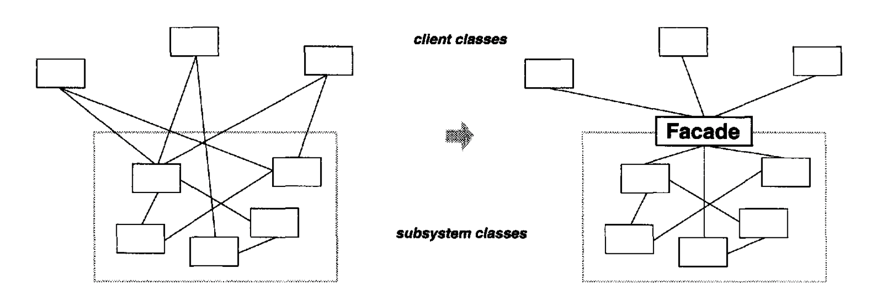
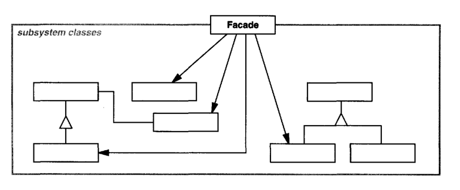

한 서브시스템 내 인터페이스 집합에 대한 획일화된 하나의 인터페이스를 제공하는 패턴이다. 서브시스템을 사용하기 쉽도록 높은 수준의 인터페이스를 제공한다.

> 서브시스템이란 시스템의 컴포넌트로, 독립적이거나 부분적으로 독립적인 기능을 제공하는 하위 시스템을 의미한다. 즉, 전체 시스템을 구성하는 기능적인 부분들 중 하나로 특정 작업을 담당한다.

## Motivation

애플리케이션이 `Scanner`, `Parser`, `ProgramNode` 등의 컴파일러 서브시스템의 하위 클래스를 직접 사용하는 것은 복잡하고 어려운 작업일 수 있다.

퍼사드 패턴을 사용해 시스템의 복잡한 부분을 숨기고, 애플리케이션이 필요한 고수준 기능만 사용할 수 있게 한다. 결과적으로 서브시스템들 사이 의사소통 및 종속성을 최소화할 수 있다.



## Applicability

- 복잡한 서브시스템에 대한 단순한 인터페이스 제공이 필요할 때
- 추상 개념에 대한 구현 클래스와 사용자 사이 너무 많은 종속성이 존재할 때
- 서브시스템을 계층화시킬 때

## Structure



- `Facade`: 단순하고 일관된 통합 인터페이스를 제공하며, 서브시스템을 구성하는 어떤 클래스가 어떤 요청을 처리해야 하는지 알고 있으며, 사용자의 요청을 해당 서브시스템 객체에 전달한다.
- `subsystem classes`: 서브시템의 기능을 구현하고, `Facade` 객체로 할당된 작업을 실제로 처리하지만 `Facade`에 대한 아무런 정보가 없다. 즉, 이들에 대한 어떤 참조자도 가지고 있지 않는다.

## Collaborations

- 사용자는 `Facade`에 정의된 인터페이스를 이용해 서브시스템과 상호작용한다. `Facade`는 해당 요청을 서브시스템을 구성하는 적당한 객체에 전달한다. 서브시스템을 구성하는 객체가 실제 요청 처리를 담당하지만, `Facade`는 서브시스템에 메시지를 전달하기 위해 자신의 인터페이스에 동일한 작업을 정의해야 한다.
- `Facade`를 사용하는 사용자는 서브시스템을 구성하는 객체로 직접 접근하지 않아도 된다.

## Consequences

1. **서브시스템의 컴포넌트를 보호할 수 있다.** 사용자가 다루어야 할 객체 수가 줄어들며, 서브시스템을 쉽게 사용할 수 있다.
2. **서브시스템과 사용자 코드 간 결합도를 더욱 약하게 만든다.**
3. **애플리케이션 쪽에서 서브시스템 클래스를 사용하는 것을 완전히 막지는 않는다.** 따라서 `Facade`를 사용할지 서브시스템 클래스를 직접 사용할지 결정할 수 있다.

## Implmentation

1. **사용자와 서브시스템 간 결합도 줄이기.**

    `Facade`를 추상 클래스로 정의하면, 구체적인 서브시스템이 아니라 `Facade` 인터페이스만 사용하여 사용자는 서브시스템의 구현 세부사항에 대해 알지 못한다.
2. **서브시스템 클래스 중 공개할 것과 감출 것.**

    서브시스템의 공개 인터페이스는 사용자가 직접 접근할 수 있는 클래스들이고, 비공개 인터페이스는 서브시스템 자체가 된다. `Facade` 클래스는 공개 인터페이스의 일부다. 다른 서브시스템 클래스들도 모두 공개될 수 있다.

    > 서브시스템 클래스를 비공개로 하는 것은 유용하지만, 많은 객체지향 언어가 이런 기능을 제공하지 않고 있다.

## Sample Code

컴파일러 시스템에 퍼사드 패턴을 적용해보자.

컴파일러 서브시스템은 `Bytecode` 객체의 스트림을 처리하는 `BytecodeStream` 클래스를 정의한다. `Bytecode` 객체는 바이트코드를 캡슐화한 것이며, 이것을 통해 기계 명령어를 명시할 수 있다. `Token` 클래스를 정의하여 프로그래밍 언어가 정의한 토큰을 캡슐화한다.

`Scanner` 클래스는 문자 스트림을 받아 토큰을 만든다.

```cpp
class Scanner {
public:
    Scanner(istream&);
    virtual ~Scanner();
    
    virtual Token& Scan();
private:
    istream& _inputStream;
};
```

`Parser`는 `ProgramNodeBuilder`를 사용해 `Scanner` 토큰에서 구문 트리(Parse Tree)를 만든다. 

```cpp
class Parser {
public:
    Parser();
    virtual ~Parser();
    
    virtual void Parse(Scanners, ProgramNodeBuilder&);
};
```

`Parser`는 `Scanner`의 토큰으로부터 구문 트리를 생성하기 위해 `ProgramNodeBuilder`를 호출한다.

```cpp
class ProgramNodeBuilder {
public:
    ProgramNodeBuilder();

    virtual ProgramNode* NewVariable(const char* variableName) const;
    virtual ProgramNode* NewAssignment(ProgramNode* variable, ProgramNode* expression) const;
    virtual ProgramNode* NewReturnStatement(ProgramNode* value) const;
    virtual ProgramNode* NewCondition(ProgramNode* condition, ProgramNode* truePart, ProgramNode* falsePart) const;
    // ...
    
    ProgramNode* GetRootNode();
private:
    ProgramNode* _node;
};
```

구문 트리는 `ProgramNode` 클래스를 상속받는 서브클래스들의 인스턴스로 되어 있다. 즉, `StatementNode`나 `ExpressionNode` 등의 인스턴스들로 구성된다.

`ProgramNode` 클래스는 프로그램 노드와 이들 컴포넌트를 다루는 방법에 대한 인터페이스를 정의한다.

```cpp
class ProgramNode {
public:
    // program node manipulation
    virtual void GetSourcePosition(int& line, int& index);
    // ...
    
    // child manipulation
    virtual void Add(ProgramNode*);
    virtual void Remove(ProgramNode*);
    // ...
    
    virtual void Traverse(CodeGenerator&);
protected:
    ProgramNode();
};
```

`Traverse()` 연산은 `CodeGenerator` 객체를 통해 이루어진다. `ProgramNode` 서브클래스들은 이 객체를 이용해 `BytecodeStream`에 정의된 `Bytecode` 객체의 형식으로 기계 코드를 생성한다.

```cpp
class CodeGenerator {
public:
    virtual void Visit(StatementNode*);
    virtual void Visit(ExpressionNode*);
    // ...
protected:
    CodeGenerator(BytecodeStream&);
protected:
    BytecodeStream& _output;
};
```

`CodeGenerator`는 `StackMachineCodeGenerator`나 `RISCCodeGenerator`의 서브클래스를 갖고, 각각 서로 다른 하드웨어 아키텍처마다 기계어를 생성한다.

`ProgramNode`의 각 서브클래스는 `Traverse()` 연산이 `ProgramNode` 객체의 요소들을 순회할 수 있도록 구현한다. 또 각 요소들 역시 다른 요소들을 포함하고 있어 이들을 또 순회해야 한다. `ExpressionNode` 클래스는 `Traverse()` 연산을 다음과 같이 정의한다.

```cpp
void ExpressionNode::Traverse(CodeGenerator& eg) {
    eg.Visit(this);
    ListIterator<PrograinNode*> i(_children);
    
    for (i.First(); !i.IsDone(); i.Next()) {
        i.Currentltem()->Traverse(eg);
    }
}
```

다음은 이들로 복합되는 컴파일러 서브시스템을 보자. `Compiler` 클래스는 지금까지 정의한 클래스들을 포함하는 퍼사드다. `Compiler`는 특정 플랫폼을 위한 소스 컴파일 및 코드 생성을 담당한다.

```cpp
class Compiler {
public:
    Compiler();
    
    virtual void Compile(istream&, BytecodeStream&);
};
void Compiler::Compile(istream& input, BytecodeStream& output){
    Scanner scanner(input);
    ProgramNodeBuilder builder;
    Parser parser;
    parser.Parse(scanner, builder);
    
    RISCCodeGenerator generator(output);
    ProgramNode* parseTree = builder.GetRootNode();
    parseTree->Traverse(generator);
}
```

이 구현은 생성한 코드 생성자의 종류를 하드코딩(`RISCCodeGenerator`)했기 때문에 프로그래머가 어떤 아키텍처를 목표로 하는지 명시하지 않아도 된다. 만약 여러 아키텍처를 대상으로 한다면 `Compiler` 클래스의 생성자를 변경해야 한다. 즉, `CodeGenerator`를 매개변수로 받도록 변경해야 한다. 또한 `Scanner`나 `ProgramNodeBuilder`을 외부에서 주입받아 응용성을 높일 수 있으나, 이는 퍼사드 패턴의 임무를 없애는 것이다. 퍼사드 패턴을 일반적인 사용을 위해 인터페이스를 간소화하는 것이기 때문이다.