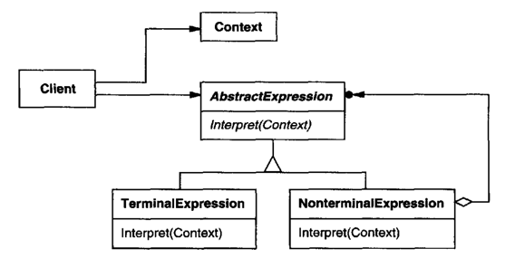

인터프리터 패턴은 주어진 언어의 문법을 정의하고 해석하는 데 사용되는 패턴이다. 컴파일러, SQL 쿼리, 정규 표현식 등에 활용된다.

## Motivation

수학 표현을 해석하고 계산하는 프로그램을 만들어야 한다고 하자. 예를 들어, 문자열 "5 + 3 - 2"를 입력하면 6을 반환하는 기능을 구현해야 한다.

인터프리터 패턴을 사용하면 +, -와 같은 연산을 쉽게 추가할 수 있고, 문법을 변경하거나 확장하는 것이 용이하다. 

## Applicability

- 정의할 언어의 문법이 간단할 때
- 효율성보다는 유지보수성과 확장성이 필요할 때

## Structure



- `AbstractExpression`: 모든 표현식(`Expression`) 클래스들이 공통으로 가져야 할 인터페이스 역할을 한다. 즉, 추상 구문 트리(Abstract Syntax Tree, AST)를 구성하는 모든 노드들이 반드시 `Interpret()` 연산을 구현하도록 강제한다.
- `TerminalExpression`: 문법에 정의한 터미널 기호(terminal symbol)에 해당하는 표현을 해석하는 역할을 한다. 터미널 기호란 더 이상 쪼갤 수 없는 기본 단위(숫자, 변수, 상수 등)을 의미한다.
- `NonterminalExpression`: 터미널 기호가 아닌 모든 규칙을 담당하는 클래스이다. 즉, $R ::= R_1R_2$ 같은 문법에서 $R$을 처리하는 클래스이며, 내부적으로 $R_1 \text{\textasciitilde} R_n$을 해석하는 방식으로 동작한다.
- `Context`: 인터프리터가 필요한 모든 정보를 저장하는 객체이다. 
- `Client`: 해석할 문장을 직접 표현하는 구조이다. AST를 구성하고 `Interpret()`을 호출한다.

## Collaborations

- 사용자는 `NonterminalExpression`과 `TerminalExpression` 인스턴스들로 해당 문장에 대한 AST를 만든다. 그리고 `Interpret()` 연산을 호출하는데, 이때 해석에 필요한 `Context` 정보를 초기화한다.
- 각 `NonterminalExpression`에서 `Interpret()` 연산은 다른 서브 표현식들의 `Interpret()`을 재귀적으로 호출해 최종 결과를 얻는다.
- 각 노드에 정의한 `Interpret()` 연산은 인터프리터의 상태를 저장하거나 그것을 알기 위해 `Context` 정보를 이용한다.

## Consequences

1. **문법의 변경과 확장이 쉽다.** 

    확장을 통해 기존 표현식을 지속적으로 수정하거나 새로운 서브클래스 정의로 새로운 표현식을 정의할 수 있다.
2. **문법의 구현이 용이하다.**

    AST의 노드에 해당하는 클래스들은 비슷한 구현 방법을 갖는다.
3. **복잡한 문법은 관리하기 어렵다.**

    각 규칙별로 적어도 하나의 클래스를 정의한다. 많은 규칙을 포함하는 문법은 더 많은 클래스를 정의해야 하기 때문에 관리, 유지가 어렵다. 이 경우 다른 패턴을 적용하는 것이 좋다.
4. **표현식을 해석하는 새로운 방법들을 추가할 수 있다.**

    새로운 방식으로 정의된 표현식을 쉽게 해석할 수 있게 해준다.

## Implementation

1. **AST를 생성한다.**

    인터프리터 패턴은 문법을 해석하는 과정만 담당할 뿐, AST를 어떻게 생성할지는 다루지 않는다. 즉, 파싱(Parsing) 과정은 인터프리터 패턴의 범위가 아니다. 인터프리터 패턴은 생성된 AST를 해석하는 역할만 담당한다.
2. **Interpret() 연산을 정의한다.**

    각 표현식 클래스에서 `Interpret()` 메서드를 정의하는 것이 일반적이지만, 만약 여러 종류의 해석 방식이 필요하다면, 방문자(Visitor) 패턴을 사용하는 것이 더 효율적이다. 


3. **Flyweight 패턴을 적용해 터미널 심볼을 공유한다.**

    터미널 심볼에 여러 번 나타나는 문장은 그 심볼에 대한 인스턴스를 공유하는 것이 바람직하다. 예를 들어, 프로그램에서 사용하는 변수는 여러 곳에 나타나기 때문에 Flyweight 패턴을 적용할 수 있다.

## Sample Code

불(boolean) 식을 처리하는 시스템을 만들어보자. 터미널 심볼은 불 변수이고, 상수 값은 참, 거짓이다. 터미널이 아닌 심볼은 `and`, `or`, `not`의 연산자를 포함한 식이다. 문법을 정의하면 다음과 같다.

```cpp
BooleanExp ::= VariableExp | Constant | OrExp | AndExp | NotExp |
                '(' BooleanExp ')'
AndExp ::= BooleanExp 'and' BooleanExp
OrExp ::= BooleanExp 'or' BooleanExp
NotExp ::= 'not' BooleanExp
Constant ::= 'true' | 'false'
VariableExp ::= 'A' | 'B' | ... | 'X' | 'Y' | 'Z'
```

불 표현식에 대해 두 개의 연산을 정의해야 한다. 먼저 변수에 참이나 거짓 값을 확인할 수 있는 `Evalute()` 연산이 필요하다. 그리고 `Replace()`로 변수를 다른 식으로 대체해 새로운 불 식을 생성한다. `Replace()` 연산은 식을 해석할 때 외에도 인터프리터 패턴을 사용할 수 있다.

여기서는 `BooleanExp`, `VariableExp`, `AndExp` 클래스에 대한 예만 확인해보자.

`BooleanExp` 클래스는 불 식을 정의하는 모든 클래스에 공통 인터페이스를 정의한다.

```cpp
class BooleanExp {
public:
    BooleanExp();
    virtual ~BooleanExp();

    virtual bool Evaluate(Context&) = 0;
    virtual BooleanExp* Replace(const char*, BooleanExp&) = 0;
    virtual BooleanExp* Copy() const = 0;
};
```

`Context` 클래스는 변수를 불 값에 대응시키는 것으로, `true`와 `false`를 표현한 클래스이다. 

```cpp
class Context {
public:
    bool Lookup(const char*) const;
    void Assign(VariableExp*, bool);
};
```

`VariableExp` 클래스는 이름을 갖는 변수를 클래스로 정의한 것이다.

```cpp
class VariableExp : public BooleanExp {
public:
    VariableExp(const char*);
    virtual ~VariableExp();

    virtual bool Evaluate(Context&);
    virtual BooleanExp* Replace(const char*, BooleanExp&);
    virtual BooleanExp* Copy() const;
private:
    char* _name;
};
```

`VariableExp()` 생성자에서 변수의 이름을 매개변수로 전달받는다.

```cpp
VariableExp::VariableExp(const char* name) {
    _name = strdup(name);
}
```

변수를 판단해 현재 상황에서의 값을 알아낸 후 반환한다.

```cpp
bool VariableExp::Evaluate(Context& aContext) {
    return aContext.Lookup(_name);
}
```

변수를 수식으로 대체하기 위해 변수가 인자로 전달받은 것과 이름이 같은지 확인해야 한다.

```cpp
BooleanExp* VariableExp::Replace(const char* name, BooleanExp& exp) {
    if (strcmp(name, _name) == 0) {
        return exp.Copy();
    } else {
        return new VariableExp(_name);
    }
}
```

`AndExp` 클래스는 두 불 식에 대해 `and` 연산한다.

```cpp
class AndExp : public BooleanExp {
public:
    AndExp(BooleanExp*, BooleanExp*);
    virtual ~AndExp();

    virtual bool Evaluate(Context&);
    virtual BooleanExp* Replace(const char*, BooleanExp&);
    virtual BooleanExp* Copy() const;
private:
    BooleanExp* _operand1;
    BooleanExp* _operand2;
};

AndExp::AndExp(BooleanExp* op1, BooleanExp* op2) {
    _operandl = op1;
    _operand2 = op2;
}
```

`AndExp` 클래스의 `Evaluate()` 연산은 피연산자를 확인해 `and`의 논리 연산을 수행한 결과를 반환한다.

```cpp
bool AndExp::Evaluate(Context& aContext) {
    return _operand1->Evaluate(aContext) && 
        _operand2->Evaluate(aContext);
}
```

`AndExp` 클래스는 `Copy()`와 `Replace()` 연산을 구현할 때 자신의 피연산자에 대한 재귀적 호출을 이용한다.

```cpp
BooleanExp* AndExp::Copy() const {
    return new AndExp(_operand1->Copy(), _operand2->Copy());
}

BooleanExp* AndExp::Replace(const char* name, BooleanExp& exp){
    return new AndExp(
            _operand1->Replace(name, exp),
            _operand2->Replace(name, exp)
        );
}
```

이제 다음 불 식을 정의해보자.

```
(true and x) or (y and (not x))
```

그리고 `x`, `y`에 실제 `true`, `false`를 할당해 값을 알아보자.

```cpp
BooleanExp* expression;
Context context;
VariableExp* x = new VariableExp("X");
VariableExp* y - new VariableExp("Y");

expression = new OrExp(
    new AndExp(new Constant(true), x),
    new AndExp(y, new NotExp(x))
);

context.Assign(x, false);
context.Assign(y, true);

bool result = expression->Evaluate(context);
```

수식은 `true` 결과를 나타낸다. 

변수 `y`를 새로운 식으로 바꾸고 다시 값을 구해보자.

```cpp
VariableExp* z = new VariableExp("Z");
NotExp not_z(z);

BooleanExp* replacement = expression->Replace("Y", not_z);

context.Assign(z, true);

result = replacement->Evaluate(context);
```

여기서 `Evaluate()`만을 인터프리터로 생각할 수 있지만, `Replace()`, `Copy()`도 일종의 인터프리터로 볼 수 있다.