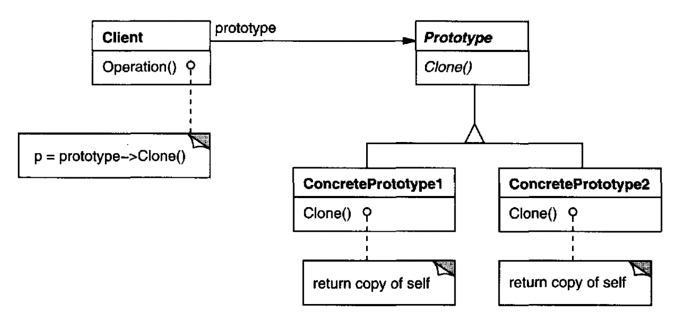

원형이 되는 인스턴스를 사용하여 생성할 객체의 종류를 명시하고, 이렇게 만든 견본을 복사해 새로운 객체를 생성한다.

## Motivation

게임 개발 시 여러 종류의 유닛을 사용하고 있다고 하자. 각 유닛 객체는 다양한 특성을 가지고 있으며, 게임에서 동일한 유닛을 복제해 새로운 유닛을 생성하는 상황이 많다. 이때, 매번 새로운 유닛을 생성하려면 비용이 크고, 시간이 많이 소요될 수 있다.

프로토타입 패턴을 사용하면 객체를 복제하는 방식으로 새로운 유닛을 생성할 수 있다. 이 패턴을 사용하면 객체의 복제가 간단해지고, 성능이 향상된다. 

## Applicability

- 인스턴스화할 클래스를 런타임에 지정할 때
- 제품 클래스 계통과 병렬적으로 만드는 팩토리 클래스를 피하고 싶을 때
- 클래스의 인스턴스들이 서로 다른 상태 조합 중 어느 하나일 때

## Structure



- `Prototype`: 자신을 복제하는 데 필요한 인터페이스를 정의
- `ConcretePrototype`: 자신을 복제하는 연산을 구현
- `Client`: 프로토타입에 자기 자신의 복제를 요청해 새로운 객체를 생성

## Consequences

1. **런타임에 새로운 제품을 추가하고 삭제할 수 있다.**
2. **값들을 다양화함으로써 새로운 객체를 명세한다.** 

    기존의 객체를 복제(clone)한 후, 그 객체의 속성(값)을 조정하여 새로운 객체를 생성한다.
3. **구조를 다양화함으로써 새로운 객체를 명세할 수 있다.**

    객체를 복제한 후, 단순히 값을 변경하는 것뿐만 아니라, 객체 내부의 컴포넌트 자체를 다양화(조합, 변경, 추가, 삭제 등) 할 수 있다. 

4. **서브클래스의 수를 줄인다.**

    프로토타입 패턴에서는 팩토리 메서드에 새로운 객체를 만들어 달라고 요청하는 것이 아니라 프로토타입을 복제하는 것이므로, `Creator` 클래스에 따른 새로운 상속 계층이 필요 없다.
5. **동적으로 클래스에 따라 애플리케이션을 설정할 수 있다.**

    애플리케이션 실행 중에 객체를 새로 생성하는 대신, 미리 정의된 프로토타입 객체를 복제하고 수정하여 다양한 객체를 생성함으로써 애플리케이션의 동작과 구성을 변경할 수 있다.

## Implementation

1. **프로토타입 관리자를 사용한다.**

    사용자는 프로토타입 자체를 다루지 않고, 단지 레지스트리에서 프로토타입을 검색하고 그것을 레지스트리에 저장할 뿐이다. 사용자는 프로토타입을 복제하기 전 레지스트리에 프로토타입이 있는지 먼저 알아본다. 이런 레지스트리를 가리켜 프로토타입 매니저(prototype manager)라 한다. 프로토타입 매니저는 어떤 키에 부합되는 프로토타입을 저장하고, 찾아서 반환하며, 삭제하는 기능을 담당하는 저장소다. 사용자는 런타임에 레지스트리를 변경하거나 검색할 수 있다. 
2. **`Clone()` 연산을 구현한다.**

    대부분의 언어는 복사 기능을 지원한다. 그러나 이런 기능들은 얕은 복사(shallow copy)와 깊은 복사(deep copy) 문제를 해결하지 못한다. 따라서 `Clone` 연산을 구현할 때 무엇을 복사하고, 무엇을 공유하도록 할 지 결정해야 한다.
3. **`Clone`을 초기화한다.**

    어떤 사용자는 내부 상태를 자신이 선택한 값으로 초기화하기를 원할 수 있다. 프로토타입의 상태를 (재)설정하기 위한 연산(`setXXX()`, `Initialize()` 등)이 프로토타입 클래스에 정의되어 있을 수 있다. 이 연산은 초기화 매개변수를 인자로 받아 복제본의 내부 상태를 설정한다.

### Sample Code

`MazePrototypeFactory`를 `MazeFactory`의 서브클래스로 정의한다. `MazePrototypeFactory`는 생성할 객체의 프로토타입으로 초기화된다. 따라서 `MazePrototypeFactory`는 생성할 벽이나 방의 클래스를 변경하기 위해 서브클래스를 만들 필요가 없다.

```cpp
class MazePrototypeFactory : public MazeFactory {
public:
    MazePrototypeFactory(Maze*, Wall*, Room*, Door*);

    virtual Maze* MakeMaze() const;
    virtual Room* MakeRoom(int) const;
    virtual Wall* MakeWall() const;
    virtual Door* MakeDoor(Room*, Room*) const;

private:
    Maze* _prototypeMaze;
    Room* _prototypeRoom;
    Wall* _prototypeWall;
    Door* _prototypeDoor;
};
```

여기에 정의된 생성자는 다음과 같이 자신의 정의하는 프로토타입들을 초기화한다.

```cpp
MazePrototypeFactory::MazePrototypeFactory(Maze* m, Wall* w, Room* r, Door* d) {
    _prototypeMaze = m;
    _prototypeWall = w;
    _prototypeRoom = r;
    _prototypeDoor = d;
}
```

각각의 프로토타입을 `Clone()` 연산을 통해 복제하고 `Initialize()`로 초기화한다. 다음은 `MakeWall()`을 통해 벽을 복제하고, `MakeDoor()`를 통해 문을 복제하며, 이를 초기화하는 과정을 보여준다.

```cpp
Wall* MazePrototypeFactory::MakeWall() const {
    return _prototypeWall->Clone();
}

Door* MazePrototypeFactory::MakeDoor(Room* r1, Room *r2) const {
    Door* door = _prototypeDoor->Clone();
    door->Initialize(r1, r2);
    return door;
}
```

`MazePrototypeFactory`를 이용해 기본 골격만 갖추거나 기본형의 미로를 만들 수 있다. 이는 미로의 기본 컴포넌트들에 대한 프로토타입으로 각 컴포넌트를 초기화함으로써 가능하다.

```cpp
MazeGame game;
MazePrototypeFactory simpleMazeFactory(
    new Maze, new Wall, new Room, new Door
);
// MazePrototypeFactory를 이용해 미로를 만듦
Maze* maze = game.CreateMaze(simpleMazeFactory);
```

미로의 형식을 바꾸려면 `MazePrototypeFactory`를 이용하되 다른 프로토타입으로 초기화하면 된다.

```cpp
MazePrototypeFactory bombedMazeFactory(
    new Maze, new BombedWall,
    new RoomWithABomb, new Door
);
```

`Wall`의 인스턴스처럼 프로토타입으로 사용할 수 있는 객체는 반드시 `Clone()` 연산을 제공해야 하고, 객체 복제를 위해 복사 생성자가 있어야 한다. 또한 내부 상태를 재초기화하기 위한 연산이 필요하다. 사용자가 방을 직접 초기화할 수 있도록 `Initialize()` 연산을 `Door`에 추가한다.

```cpp
class Door : public MapSite {
public:
    Door();
    Door(const Door&);  // 복사 생성자

    virtual void Initialize(Room*, Room*);
    virtual Door* Clone() const;
    virtual void Enter();
    Room* OtherSideFrom(Room*);
private:
    Room* _room1;
    Room* _room2;
};

Door::Door(const Door& other) {    // 복사 기능의 생성자
    _room1 = other._room1;
    _room2 = other._room2;
}

void Door::Initialize(Room* r1, Room* r2) {    // 초기화 연산
    _rooml = r1;
    _room2 = r2;
}

Door* Door::Clone() const {
    return new Door(*this);
}
```

`BombedWall` 서브클래스는 `Clone()`을 재정의하고 복사 생성자를 구현해야 한다.

```cpp
class BombedWall : public Wall {
public:
    BombedWall();
    BombedWall(const BombedWall&);

    virtual Wall* Clone() const;
    bool HasBomb();
private:
    bool _bomb;
};

BombedWall::BombedWall(const BombedWall& other) : Wall(other) {
    _bomb = other._bomb;
}

Wall* BombedWall::Clone() const {
    return new BombedWall(*this);
}
```

`BombedWall::Clone()` 연산이 `Wall*`을 반환하지만, 그 구현은 `Wall`의 서브클래스인 `BombedWall*`의 인스턴스를 반환한다. `Clone()` 연산도 이와 비슷하게 정의해야 한다. 즉, 사용자가 구체적인 서브클래스를 몰라도 프로토타입을 복제할 수 있도록 해야 하는 것이다. 사용자는 `Clone()` 연산의 반환값을 자신이 원하는 타입으로 다운캐스트 할 필요가 없어야 한다.